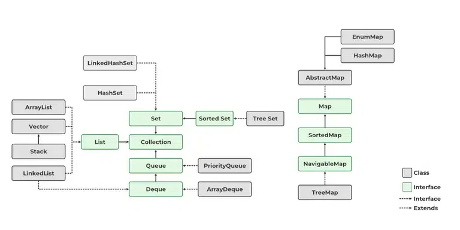

# Java Collections Framework

## 1. Overview of Collections Framework

The Java Collections Framework (JCF) is a unified architecture for representing and manipulating collections, enabling
developers to work with data more efficiently and effectively. It provides a set of interfaces, implementations, and
algorithms to handle groups of objects.



## 2. Collection Interfaces: List, Set, Queue, Map

### List

The `List` interface represents an ordered collection (also known as a sequence). It allows duplicate elements and
provides methods to manipulate the size of the list. Common implementations include:

- **ArrayList**: Resizable array implementation of the `List` interface.
- **LinkedList**: Doubly-linked list implementation, allowing for faster insertion and deletion of elements.
- **Vector**: Similar to `ArrayList`, but synchronized and thus thread-safe.
- **Stack**: Represents a last-in-first-out (LIFO) stack of objects.

### Set

The `Set` interface represents a collection that cannot contain duplicate elements. Implementations include:

- **HashSet**: Hash table-based implementation; allows null elements.
- **LinkedHashSet**: Maintains a linked list of the entries to preserve the insertion order.
- **TreeSet**: Implements a navigable set using a red-black tree, ensuring elements are sorted.

### Queue

The `Queue` interface represents a collection designed for holding elements prior to processing. Common implementations
are:

- **PriorityQueue**: A queue that orders its elements based on their natural ordering or a specified comparator.
- **LinkedList**: Also implements the `Queue` interface, providing flexibility for queue operations.

### Map

The `Map` interface represents a collection of key-value pairs, with unique keys. Implementations include:

- **HashMap**: Hash table-based implementation of the `Map` interface, allowing null values and one null key.
- **LinkedHashMap**: Maintains a linked list of entries for predictable iteration order.
- **TreeMap**: Implements a red-black tree to provide a sorted map.
- **Hashtable**: Similar to `HashMap`, but synchronized and does not allow null keys or values.

## 3. Implementations of Collection Interfaces

### List

- `List` is an interface in the Java Collections Framework.
- It represents an ordered collection (also known as a sequence).
- Lists can contain duplicate elements, and they maintain insertion order.
- Elements can be accessed by their position (index) in the list.
- It is a part of the `java.util` package.

### Commonly Used List Implementations

#### `ArrayList`

`ArrayList` is based on a dynamically resizable array. It provides random access to elements, making it very fast when
accessing elements by index. When elements are added, and the internal array is full, a new array is created with 1.5
times the current capacity, and the existing elements are copied into the new array.

- Backed by a dynamic array.
- Provides fast random access (get and set operations) with O(1) complexity.
- Adding or removing elements at the end is generally O(1).
- Adding or removing elements in the middle requires shifting, which results in O(n) complexity.
- Allows `null` values.

#### Internal Working:

- `ArrayList` uses an array internally.
- When elements are added, and the internal array is full, a new array is created with 1.5 times the current capacity,
  and existing elements are copied into the new array.
- It maintains an internal `size` variable that tracks the number of elements.

#### Example:

```java
import java.util.ArrayList;
import java.util.List;

public class ArrayListExample {
  public static void main(String[] args) {
    List<String> fruits = new ArrayList<>();
    fruits.add("Apple");
    fruits.add("Banana");
    fruits.add("Mango");
    fruits.add("Apple"); // Duplicates are allowed

    System.out.println(fruits); // Output: [Apple, Banana, Mango, Apple]
  }
}
```

- **Time Complexity**:
    - Access: O(1) (Random access is fast, like an array.)
    - Insert (at end): O(1) (Amortized). If resizing is needed (e.g., if the internal array is full), it becomes O(n)
      due to the cost of copying elements.
    - Insert (at index): O(n) (Elements need to be shifted to the right.)
    - Remove: O(n) (Elements need to be shifted to the left after removal.)

#### `LinkedList`

`LinkedList` is a doubly-linked list. Each element (node) contains a data part and two pointers to the next and previous
elements. This makes it efficient for inserting or deleting elements at the beginning or middle but slower for accessing
elements by index.

- Implements a doubly-linked list.
- Allows `null` values.
- Good for scenarios where frequent addition or removal of elements occurs at the beginning or middle.
- Accessing elements is slower than `ArrayList` because it needs to traverse the list.
- Suitable for implementing queues and deques.

#### Internal Working:

- `LinkedList` consists of nodes, where each node contains data, a reference to the next node, and a reference to the
  previous node.
- It uses a `head` and `tail` pointer to track the first and last nodes.
- It is efficient for insertions or deletions at the beginning or end due to the doubly-linked structure.

#### Example:

```java
import java.util.LinkedList;
import java.util.List;

public class LinkedListExample {
  public static void main(String[] args) {
    List<String> cities = new LinkedList<>();
    cities.add("New York");
    cities.add("Los Angeles");
    cities.add("Chicago");

    System.out.println(cities); // Output: [New York, Los Angeles, Chicago]
  }
}
```

- **Time Complexity**:
    - Access: O(n) (Needs to traverse from the head or tail to the desired index.)
    - Insert (at start or end): O(1) (Inserting at the beginning or end is quick as there's a reference to the first and
      last node.)
    - Insert (at index): O(n) (Needs traversal to reach the desired index.)
    - Remove (at start or end): O(1) (Removing the first or last node is quick as there's a reference to the first and
      last node.)
    - Remove (at index): O(n) (Needs traversal to reach the desired index.)

#### `Vector`

`Vector` is similar to `ArrayList`, but it is synchronized, making it thread-safe. However, this synchronization results
in a performance overhead when used in a single-threaded environment.

- Synchronized version of `ArrayList`.
- Thread-safe but slower due to synchronization overhead.
- Provides methods like `addElement()` which is not part of the `List` interface.
- Allows `null` values.
- Rarely used in modern applications where `ArrayList` is preferred with external synchronization if needed.
- Vectors grow by doubling their size when they reach capacity.

### Internal Working:

- `Vector` internally uses a dynamic array like `ArrayList`.
- It is synchronized, making it thread-safe for multi-threaded environments.
- The size increases by doubling when the internal array reaches its capacity.

#### Example:

```java
import java.util.Vector;
import java.util.List;

public class VectorExample {
  public static void main(String[] args) {
    List<Integer> numbers = new Vector<>();
    numbers.add(10);
    numbers.add(20);
    numbers.add(30);

    System.out.println(numbers); // Output: [10, 20, 30]
  }
}
```

- **Time Complexity**:
    - Access: O(1) (Random access is fast, like an array.)
    - Insert (at end): O(1) (Amortized). If resizing is needed (e.g., if the internal array is full), it becomes O(n)
      due to the cost of copying elements.
    - Insert (at index): O(n) (Elements need to be shifted to the right.)
    - Remove: O(n) (Elements need to be shifted to the left after removal.)

#### `Stack`

The `Stack` class is based on the `Vector` class, meaning it inherits all the properties and methods of `Vector`. This
includes dynamic array behavior, where elements are stored in an array that can resize itself when needed.

- A subclass of `Vector` that represents a last-in, first-out (LIFO) stack of objects.
- Provides methods like `push()`, `pop()`, `peek()`, and `empty()`.
- Thread-safe but rarely used in modern applications where `Deque` is preferred.
- When you push an element, it adds to the end of the array.
- When you pop or peek, it accesses or removes the element at the last index of the array.

### Internal Working:

- `Stack` uses the same dynamic array mechanism as `Vector`.
- When you push an element, it adds to the end of the array.
- When you pop or peek, it accesses or removes the element at the last index of the array.
- The LIFO behavior is achieved by adding/removing elements from the end.

#### Example:

```java
import java.util.Stack;

public class StackExample {
  public static void main(String[] args) {
    Stack<String> stack = new Stack<>();
    stack.push("First");
    stack.push("Second");
    stack.push("Third");

    System.out.println(stack.pop()); // Output: Third (LIFO)
    System.out.println(stack.peek()); // Output: Second (next element to be popped)
  }
}
```

- **Time Complexity**:
    - Access: O(n) (Since direct access is not typically used, stack operations like peek() and search() are more
      common.)
    - Push (Insert at end): O(1) (Amortized). Resizing can make it O(n).
    - Pop (Remove at end): O(1)
    - Peek: O(1)
    - Search: O(n) (Because it may need to iterate through the stack.)

### When to Use Which `List` Implementation?

- Use `ArrayList` if:
    - You need fast random access to elements.
    - Insertion and deletion operations are mostly at the end.
- Use `LinkedList` if:
    - You have frequent insertions and deletions in the middle or beginning.
    - Memory consumption is not a major concern.
- Use `Vector` or `Stack` if:
    - You need a thread-safe version of `ArrayList` or a stack behavior with synchronization.

### Important Methods in `List` Interface

- `add(E e)`: Adds an element to the list.
- `get(int index)`: Returns the element at the specified position.
- `remove(int index)`: Removes the element at the specified position.
- `size()`: Returns the number of elements in the list.
- `isEmpty()`: Checks if the list is empty.
- `contains(Object o)`: Checks if the list contains the specified element.
- `clear()`: Removes all elements from the list.

### Differences between `List` Implementations

| Feature                       | `ArrayList`                                      | `LinkedList`                                          | `Vector`                                  | `Stack`                                                 |
|-------------------------------|--------------------------------------------------|-------------------------------------------------------|-------------------------------------------|---------------------------------------------------------|
| **Underlying Data Structure** | Resizable array                                  | Doubly linked list                                    | Resizable array                           | Inherits from `Vector`                                  |
| **Performance**               | Fast random access (O(1) for `get`)              | Slow random access (O(n) for `get`)                   | Similar to `ArrayList` but synchronized   | Similar to `Vector` but LIFO behavior                   |
| **Insertion Performance**     | Adding at the end is O(1) (amortized)            | Adding at the end is O(1)                             | Adding at the end is O(1) (amortized)     | Push is O(1)                                            |
| **Removal Performance**       | Removing by index is O(n)                        | Removing from the beginning is O(1)                   | Removing by index is O(n)                 | Pop is O(1)                                             |
| **Synchronization**           | Not synchronized                                 | Not synchronized                                      | Synchronized                              | Synchronized                                            |
| **Memory Efficiency**         | Less memory overhead due to array storage        | More memory overhead due to node storage              | Less memory overhead due to array storage | Similar to `Vector`                                     |
| **Use Cases**                 | Best for read-heavy operations and random access | Best for insertions/deletions at the beginning/middle | Use when synchronization is needed        | Use for LIFO data structures (e.g., undo functionality) |

### Set

A `Set` is a part of the Java Collections Framework. It is an interface that extends the `Collection` interface and
represents a collection of unique elements. Sets do not allow duplicate values, which means each element in a set must
be unique. `Set` is implemented by various classes in the Java Collections Framework.

- **No Duplicates**: A `Set` cannot contain duplicate elements.
- **Unordered**: The elements in a `Set` are not stored in any particular order.
- **Null Elements**: Some implementations of `Set` allow null elements (e.g., `HashSet`), while others may not (e.g.,
  `TreeSet`).

### Commonly Used Set Implementations

#### `HashSet`

- `HashSet` is the most commonly used implementation of the `Set` interface.
- It **does not maintain any order** of the elements.
- It allows **one null element**.
- **Internally** uses a **hash table** for storing elements.
- It provides **constant-time performance (O(1))** for basic operations like add, remove, and contains (under ideal
  conditions).

#### Internal Working:

- Uses a **hash table** where each element is hashed to determine its position.
- When a new element is added, its **hashCode()** is calculated, and it is stored in a **bucket**.
- If multiple elements have the same hash code (hash collision), they are stored in a **linked list** or a **tree
  structure** (in case of Java 8+).

#### Example

```java
import java.util.HashSet;
import java.util.Set;

public class HashSetExample {
  public static void main(String[] args) {
    Set<String> fruits = new HashSet<>();
    fruits.add("Apple");
    fruits.add("Banana");
    fruits.add("Orange");
    fruits.add("Apple"); // Duplicate, will be ignored

    System.out.println(fruits); // Output: [Banana, Orange, Apple] (Order may vary)
  }
}
```

#### `LinkedHashSet`

- `LinkedHashSet` extends `HashSet` and **maintains insertion order**.
- It uses a **doubly-linked list** along with the hash table.
- Allows **one null element**.
- Performance is slightly lower than `HashSet` due to the extra overhead of maintaining the **linked list**.

#### Internal Working:

- Uses a **hash table** similar to `HashSet` but maintains a **doubly-linked list** to remember the insertion order of
  elements.
- When iterating over a `LinkedHashSet`, elements are returned in the order they were inserted.

#### Example

```java
import java.util.LinkedHashSet;
import java.util.Set;

public class LinkedHashSetExample {
  public static void main(String[] args) {
    Set<String> cities = new LinkedHashSet<>();
    cities.add("New York");
    cities.add("London");
    cities.add("Tokyo");
    cities.add("New York"); // Duplicate, will be ignored

    System.out.println(cities); // Output: [New York, London, Tokyo]
  }
}
```

#### `TreeSet`

- `TreeSet` is an implementation of the `SortedSet` interface and stores elements in **sorted order**.
- It uses a **Red-Black tree** internally.
- Does not allow **null elements**.
- Provides **logarithmic time performance (O(log n))** for add, remove, and contains operations.

#### Internal Working:

- Uses a **self-balancing binary search tree (Red-Black tree)** for storing elements.
- Elements are sorted in their **natural order** (or by a custom comparator if provided).
- It provides methods like `headSet()`, `tailSet()`, and `subSet()` to get subsets of the `TreeSet`.

#### Example

```java
import java.util.Set;
import java.util.TreeSet;

public class TreeSetExample {
  public static void main(String[] args) {
    Set<Integer> numbers = new TreeSet<>();
    numbers.add(5);
    numbers.add(1);
    numbers.add(10);
    numbers.add(2);

    System.out.println(numbers); // Output: [1, 2, 5, 10] (Sorted order)
  }
}
```

### When to Use Which Set Implementation?

- **Use `HashSet`** if you do not need to maintain the order of elements and want fast insertion, deletion, and lookup.
- **Use `LinkedHashSet`** if you want to maintain the insertion order of elements.
- **Use `TreeSet`** if you need a sorted set of elements.

### Important Methods of Set

- `add(E e)`: Adds the specified element to the set if it is not already present.
- `remove(Object o)`: Removes the specified element from the set if it is present.
- `contains(Object o)`: Returns `true` if the set contains the specified element.
- `size()`: Returns the number of elements in the set.
- `isEmpty()`: Returns `true` if the set contains no elements.
- `clear()`: Removes all elements from the set.

### Differences between `Set` Implementations

| Feature              | `HashSet`                                                     | `LinkedHashSet`                                         | `TreeSet`                                                  |
|----------------------|---------------------------------------------------------------|---------------------------------------------------------|------------------------------------------------------------|
| Order                | No specific order                                             | Maintains insertion order                               | Sorted (Natural or Custom Comparator)                      |
| Underlying Structure | Hash table                                                    | Hash table + Linked list                                | Red-Black tree                                             |
| Null Values          | Allows one null                                               | Allows one null                                         | Does not allow null                                        |
| Performance          | Fastest for basic operations (O(1) for add, remove, contains) | Slightly slower than `HashSet` due to maintaining order | Slower (O(log n) for add, remove, contains) due to sorting |

### 3. Queue

The `Queue` interface represents a collection designed for holding elements prior to processing. Common implementations
are:

- **PriorityQueue**: A queue that orders its elements based on their natural ordering or a specified comparator.
- **LinkedList**: Also implements the `Queue` interface, providing flexibility for queue operations.

### 4. Map

The `Map` interface represents a collection of key-value pairs, with unique keys. Implementations include:

- **HashMap**: Hash table-based implementation of the `Map` interface, allowing null values and one null key.
- **LinkedHashMap**: Maintains a linked list of entries for predictable iteration order.
- **TreeMap**: Implements a red-black tree to provide a sorted map.
- **Hashtable**: Similar to `HashMap`, but synchronized and does not allow null keys or values.

## Comparisons

### ArrayList vs. LinkedList

- **ArrayList**: Better for frequent access operations due to its array-based structure.
- **LinkedList**: Better for frequent insertions and deletions.

### HashMap vs. TreeMap

- **HashMap**: Provides constant time complexity for basic operations but does not maintain order.
- **TreeMap**: Provides log(n) time complexity for basic operations while maintaining sorted order.

### HashSet vs. TreeSet

- **HashSet**: Fast operations with no order.
- **TreeSet**: Slower but maintains a sorted order of elements.

## Collections Utility Class

The `Collections` utility class provides static methods for various operations on collections, such as:

- Sorting (`Collections.sort()`)
- Shuffling (`Collections.shuffle()`)
- Searching (`Collections.binarySearch()`)
- Synchronized wrappers for thread-safe collections (`Collections.synchronizedList()`)

## Sorting, Searching, and Shuffling Collections

- Sorting: Rearranges the elements based on natural ordering or a custom comparator.
- Searching: Locates an element using algorithms like binary search.
- Shuffling: Randomly permutes the elements in a collection.

## Synchronized Collections

Synchronized collections are thread-safe implementations that prevent concurrent modification, ensuring safe access in
multithreaded environments.

## Unmodifiable Collections

Unmodifiable collections prevent modifications after their creation. They are useful for protecting data from changes
and can be created using methods like `Collections.unmodifiableList()`.
