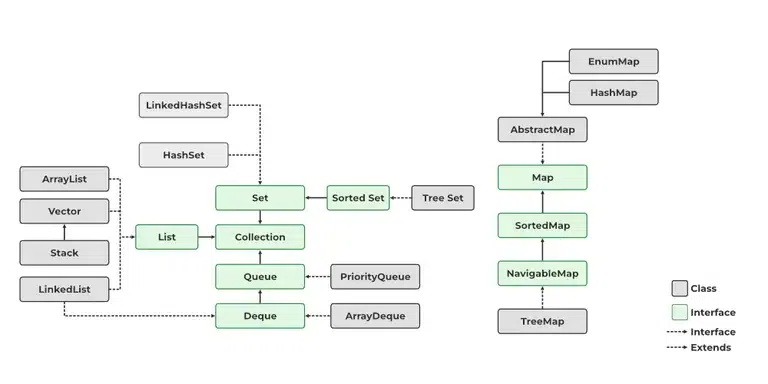

# [Java Collections Framework](https://github.com/aamirxshaikh/interview-prep/tree/main/core-java/src/main/java/com/interviewprep/java_collections_framework)

## 1. Iterable and Iterator

### Iterable Interface

The `Iterable` interface is the root interface for collections in Java, and it represents a collection that can be
iterated over. It contains a single abstract method `iterator()` which returns an iterator.

#### Using Iterable

When a class implements the `Iterable` interface, it can be the target of the enhanced for loop (`for-each` loop) in
Java.

**Example:**

```java
import java.util.ArrayList;
import java.util.Iterator;
import java.util.List;

public class IterableExample {
  public static void main(String[] args) {
    List<String> items = new ArrayList<>();
    items.add("Apple");
    items.add("Banana");
    items.add("Cherry");

    for (String item : items) {
      System.out.println(item);
    }
  }
}
```

### Iterator Interface

The `Iterator` interface provides a way to traverse through elements in a collection, one at a time. It is a part of the
Java Collections Framework and offers three main methods.

#### Using Iterator

An `Iterator` can be used to iterate over any `Collection`. It provides control over the iteration process and allows
element removal.

#### Key Features of Iterator

1. **Unidirectional Traversal**:
    - `Iterator` allows you to traverse a collection in a single direction only (forward). Unlike `ListIterator`, it
      cannot go backward.

2. **Element Removal**:
    - The `Iterator` interface allows you to remove elements during iteration using its `remove()` method. Direct
      removal from the underlying collection (e.g., `List.remove()`) while iterating will cause a
      `ConcurrentModificationException`.

3. **Applicable to All Collections**:
    - `Iterator` is applicable to all classes that implement the `Collection` interface, making it versatile across
      different collection types (`List`, `Set`, `Queue`, etc.).

4. **Fail-Fast Behavior**:
    - `Iterator` is a fail-fast iterator. If the structure of the collection is modified after creating an iterator (
      except through `iterator.remove()`), it throws `ConcurrentModificationException`.

**Example:**

```java
import java.util.ArrayList;
import java.util.Iterator;
import java.util.List;

public class IteratorExample {
  public static void main(String[] args) {
    List<String> items = new ArrayList<>();
    items.add("Apple");
    items.add("Banana");
    items.add("Cherry");

    Iterator<String> iterator = items.iterator();
    while (iterator.hasNext()) {
      String item = iterator.next();
      if (item.equals("Banana")) {
        iterator.remove();
      }
    }
    System.out.println(items); // [Apple, Cherry]
  }
}
```

#### Common Methods of Iterator

- `hasNext()`: Returns `true` if the iterator has more elements.
- `next()`: Returns the next element in the iteration.
- `remove()`: Removes the last element returned by the iterator.

#### What You Can and Cannot Do with Iterator

Allowed Operations

1. **Iterate Over Collection Elements**:
    - `Iterator` allows controlled traversal over elements of a collection in forward direction only.
2. **Conditionally Remove Elements**:
    - Use `iterator.remove()` to remove an element safely during iteration. This is particularly useful for filtering
      out elements based on a condition.

Restricted Operations

1. **Adding Elements During Iteration**:
    - You cannot add elements to the collection directly during iteration. Doing so will cause a
      `ConcurrentModificationException`.
2. **Direct Collection Modifications**:
    - Modifying the collection outside the `Iterator` methods (like using `collection.remove()`) while iterating results
      in `ConcurrentModificationException`.
3. **Backward Traversal**:
    - `Iterator` does not support backward traversal. For bidirectional traversal in lists, `ListIterator` should be
      used.

### ListIterator Interface

`ListIterator` is an extension of the `Iterator` interface specifically for `List` collections. It allows bi-directional
traversal, meaning you can iterate forwards and backwards.

#### Using ListIterator

`ListIterator` can be used to traverse a list and make modifications like adding or replacing elements.

**Example:**

```java
import java.util.ArrayList;
import java.util.List;
import java.util.ListIterator;

public class ListIteratorExample {
  public static void main(String[] args) {
    List<String> items = new ArrayList<>();
    items.add("Apple");
    items.add("Banana");
    items.add("Cherry");

    ListIterator<String> listIterator = items.listIterator();
    while (listIterator.hasNext()) {
      String item = listIterator.next();
      if (item.equals("Banana")) {
        listIterator.set("Blueberry");
      }
    }
    System.out.println(items); // [Apple, Blueberry, Cherry]
  }
}
```

#### Common Methods of ListIterator

- `hasNext()`, `next()`: Similar to the `Iterator` interface.
- `hasPrevious()`, `previous()`: Allows backward traversal of the list.
- `add(E e)`: Inserts the specified element into the list.
- `set(E e)`: Replaces the last element returned by `next()` or `previous()`.

### forEach Loop and Iterable

The `forEach` loop can be used with any class implementing the `Iterable` interface, providing a clean and concise way
to iterate over elements.

**Example:**

```java
for(String item :items){
        System.out.println(item);
}
```

### Fail-Fast vs. Fail-Safe Iterators

- **Fail-Fast Iterators**: These iterators throw a `ConcurrentModificationException` if the collection is modified after
  the iterator is created. Examples include iterators for `ArrayList`, `HashSet`, etc.
- **Fail-Safe Iterators**: These iterators operate on a copy of the collection, allowing modifications without throwing
  an exception. Examples include iterators for `CopyOnWriteArrayList` and `ConcurrentHashMap`.

### Understanding ConcurrentModificationException and Safe Modification Approaches

In Java, modifying a collection while iterating over it can lead to a `ConcurrentModificationException` if not done
properly. This document explains why direct modifications cause this exception, how `iterator.remove()` safely removes
elements, and why collections like `CopyOnWriteArrayList` and `ConcurrentHashMap` do not throw this exception.

#### Why Direct Modification Causes ConcurrentModificationException

1. **Structural Modifications**:
    - A "structural modification" refers to any change that alters the size of a collection (e.g., adding or removing
      elements).
    - When an iterator is created on a collection, it takes a snapshot of the collection's state. Direct modifications
      disrupt this state, causing the iterator to detect an inconsistency.

2. **Fail-Fast Iterators**:
    - Standard collections in Java (like `ArrayList`, `HashSet`, `HashMap`) use fail-fast iterators. These iterators
      throw `ConcurrentModificationException` if they detect a structural modification from outside the iterator while
      iterating.
    - The exception is triggered because the iterator internally tracks modifications via a "modification count" (
      modCount). If the modCount does not match the expected count during iteration, it detects external changes and
      throws an exception.

**Example**:
```java
List<String> list = new ArrayList<>();
list.add("A");
list.add("B");
list.add("C");

for (String item : list) {
    list.remove(item); // Throws ConcurrentModificationException
}
```

In this example, modifying the list directly during iteration leads to `ConcurrentModificationException` since the
list’s modCount is altered unexpectedly for the iterator.

#### Why Iterator.remove() Does Not Cause ConcurrentModificationException

1. **Safe Removal through Iterator**:
    - The `remove()` method in `Iterator` is designed to work with the iterator's internal state, safely adjusting the
      modification count.
    - When `iterator.remove()` is called, it removes the element and updates the iterator’s internal modCount to prevent
      `ConcurrentModificationException`.

**Example**:
```java
List<String> list = new ArrayList<>();
list.add("A");
list.add("B");
list.add("C");

Iterator<String> iterator = list.iterator();
while (iterator.hasNext()) {
    String item = iterator.next();
    if ("A".equals(item)) {
        iterator.remove(); // Safe removal, does not throw ConcurrentModificationException
    }
}
```

In this example, `iterator.remove()` safely removes the element by synchronizing the iterator's state with the
collection's structure.

#### Why `CopyOnWriteArrayList` and `ConcurrentHashMap` Do Not Cause `ConcurrentModificationException`

1. **CopyOnWriteArrayList**:
    - `CopyOnWriteArrayList` is designed for safe concurrent access. When modified (e.g., add, remove), it creates a new
      copy of the underlying array, leaving the iterator’s snapshot unaffected.
    - Since each modification results in a new array, the original iterator can continue iterating over the old snapshot
      without detecting structural changes.

**Example**:
```java
CopyOnWriteArrayList<String> list = new CopyOnWriteArrayList<>();
list.add("A");
list.add("B");
list.add("C");

for (String item : list) {
    list.remove(item); // No ConcurrentModificationException
}
```

- In this example, `CopyOnWriteArrayList` avoids the exception by creating a new copy on each modification, which
  isolates the iteration snapshot from any changes.

2. **ConcurrentHashMap**:
    - `ConcurrentHashMap` allows concurrent modification by multiple threads without throwing
      `ConcurrentModificationException`.
    - It achieves thread safety by dividing the map into segments, allowing multiple threads to read and write in
      different segments simultaneously without affecting each other's operations.
    - Iterators for `ConcurrentHashMap` are fail-safe, meaning they do not throw `ConcurrentModificationException`
      because they do not rely on modCount. Instead, they reflect the state of the map at the moment of iteration but
      may not show subsequent modifications.

**Example**:
```java
ConcurrentHashMap<String, String> map = new ConcurrentHashMap<>();
map.put("1", "A");
map.put("2", "B");

for (String key : map.keySet()) {
    map.remove(key); // No ConcurrentModificationException
}
```

- In this example, `ConcurrentHashMap` permits safe removal during iteration without throwing
  `ConcurrentModificationException`.

## 2. Overview of Collections Framework

The Java Collections Framework (JCF) is a unified architecture for representing and manipulating collections, enabling
developers to work with data more efficiently and effectively. It provides a set of interfaces, implementations, and
algorithms to handle groups of objects.



## 3. Collection Interfaces: List, Set, Queue, Map

### List

The `List` interface represents an ordered collection (also known as a sequence). It allows duplicate elements and
provides methods to manipulate the size of the list. Common implementations include:

- **ArrayList**: Resizable array implementation of the `List` interface.
- **LinkedList**: Doubly-linked list implementation, allowing for faster insertion and deletion of elements.
- **Vector**: Similar to `ArrayList`, but synchronized and thus thread-safe.
- **Stack**: Represents a last-in-first-out (LIFO) stack of objects.

### Map

The `Map` interface represents a collection of key-value pairs, with unique keys. Implementations include:

- **HashMap**: Hash table-based implementation of the `Map` interface, allowing null values and one null key.
- **LinkedHashMap**: Maintains a linked list of entries for predictable iteration order.
- **TreeMap**: Implements a red-black tree to provide a sorted map.
- **Hashtable**: Similar to `HashMap`, but synchronized and does not allow null keys or values.

### Set

The `Set` interface represents a collection that cannot contain duplicate elements. Implementations include:

- **HashSet**: Hash table-based implementation; allows null elements.
- **LinkedHashSet**: Maintains a linked list of the entries to preserve the insertion order.
- **TreeSet**: Implements a navigable set using a red-black tree, ensuring elements are sorted.

### Queue

The `Queue` interface represents a collection designed for holding elements prior to processing. Common implementations
are:

- **PriorityQueue**: A queue that orders its elements based on their natural ordering or a specified comparator.
- **ArrayDeque**: Resizable-array implementation of the `Deque` interface, allowing fast insertion and removal operations.
- **LinkedList**: Also implements the `Queue` interface, providing flexibility for queue operations.

## 4. Implementations of Collection Interfaces

### List

- `List` is an interface in the Java Collections Framework.
- It represents an ordered collection (also known as a sequence).
- Lists can contain duplicate elements, and they maintain insertion order.
- Elements can be accessed by their position (index) in the list.
- It is a part of the `java.util` package.

### Commonly Used List Implementations

#### `ArrayList`

`ArrayList` is based on a dynamically resizable array. It provides random access to elements, making it very fast when
accessing elements by index. When elements are added, and the internal array is full, a new array is created with 1.5
times the current capacity, and the existing elements are copied into the new array.

- Backed by a dynamic array.
- Provides fast random access (get and set operations) with O(1) complexity.
- Adding or removing elements at the end is generally O(1).
- Adding or removing elements in the middle requires shifting, which results in O(n) complexity.
- Allows `null` values.

#### Internal Working:

- `ArrayList` uses an array internally.
- When elements are added, and the internal array is full, a new array is created with 1.5 times the current capacity,
  and existing elements are copied into the new array.
- It maintains an internal `size` variable that tracks the number of elements.

#### Example:

```java
import java.util.ArrayList;
import java.util.List;

public class ArrayListExample {
  public static void main(String[] args) {
    List<String> fruits = new ArrayList<>();
    fruits.add("Apple");
    fruits.add("Banana");
    fruits.add("Mango");
    fruits.add("Apple"); // Duplicates are allowed

    System.out.println(fruits); // Output: [Apple, Banana, Mango, Apple]
  }
}
```

- **Time Complexity**:
    - Access: O(1) (Random access is fast, like an array.)
    - Insert (at end): O(1) (Amortized). If resizing is needed (e.g., if the internal array is full), it becomes O(n)
      due to the cost of copying elements.
    - Insert (at index): O(n) (Elements need to be shifted to the right.)
    - Remove: O(n) (Elements need to be shifted to the left after removal.)

#### `LinkedList`

`LinkedList` is a doubly-linked list. Each element (node) contains a data part and two pointers to the next and previous
elements. This makes it efficient for inserting or deleting elements at the beginning or middle but slower for accessing
elements by index.

- Implements a doubly-linked list.
- Allows `null` values.
- Good for scenarios where frequent addition or removal of elements occurs at the beginning or middle.
- Accessing elements is slower than `ArrayList` because it needs to traverse the list.
- Suitable for implementing queues and deques.

#### Internal Working:

- `LinkedList` consists of nodes, where each node contains data, a reference to the next node, and a reference to the
  previous node.
- It uses a `head` and `tail` pointer to track the first and last nodes.
- It is efficient for insertions or deletions at the beginning or end due to the doubly-linked structure.

#### Example:

```java
import java.util.LinkedList;
import java.util.List;

public class LinkedListExample {
  public static void main(String[] args) {
    List<String> cities = new LinkedList<>();
    cities.add("New York");
    cities.add("Los Angeles");
    cities.add("Chicago");

    System.out.println(cities); // Output: [New York, Los Angeles, Chicago]
  }
}
```

- **Time Complexity**:
    - Access: O(n) (Needs to traverse from the head or tail to the desired index.)
    - Insert (at start or end): O(1) (Inserting at the beginning or end is quick as there's a reference to the first and
      last node.)
    - Insert (at index): O(n) (Needs traversal to reach the desired index.)
    - Remove (at start or end): O(1) (Removing the first or last node is quick as there's a reference to the first and
      last node.)
    - Remove (at index): O(n) (Needs traversal to reach the desired index.)

#### `Vector`

`Vector` is similar to `ArrayList`, but it is synchronized, making it thread-safe. However, this synchronization results
in a performance overhead when used in a single-threaded environment.

- Synchronized version of `ArrayList`.
- Thread-safe but slower due to synchronization overhead.
- Provides methods like `addElement()` which is not part of the `List` interface.
- Allows `null` values.
- Rarely used in modern applications where `ArrayList` is preferred with external synchronization if needed.
- Vectors grow by doubling their size when they reach capacity.

### Internal Working:

- `Vector` internally uses a dynamic array like `ArrayList`.
- It is synchronized, making it thread-safe for multi-threaded environments.
- The size increases by doubling when the internal array reaches its capacity.

#### Example:

```java
import java.util.Vector;
import java.util.List;

public class VectorExample {
  public static void main(String[] args) {
    List<Integer> numbers = new Vector<>();
    numbers.add(10);
    numbers.add(20);
    numbers.add(30);

    System.out.println(numbers); // Output: [10, 20, 30]
  }
}
```

- **Time Complexity**:
    - Access: O(1) (Random access is fast, like an array.)
    - Insert (at end): O(1) (Amortized). If resizing is needed (e.g., if the internal array is full), it becomes O(n)
      due to the cost of copying elements.
    - Insert (at index): O(n) (Elements need to be shifted to the right.)
    - Remove: O(n) (Elements need to be shifted to the left after removal.)

#### `Stack`

The `Stack` class is based on the `Vector` class, meaning it inherits all the properties and methods of `Vector`. This
includes dynamic array behavior, where elements are stored in an array that can resize itself when needed.

- A subclass of `Vector` that represents a last-in, first-out (LIFO) stack of objects.
- Provides methods like `push()`, `pop()`, `peek()`, and `empty()`.
- Thread-safe but rarely used in modern applications where `Deque` is preferred.
- When you push an element, it adds to the end of the array.
- When you pop or peek, it accesses or removes the element at the last index of the array.

### Internal Working:

- `Stack` uses the same dynamic array mechanism as `Vector`.
- When you push an element, it adds to the end of the array.
- When you pop or peek, it accesses or removes the element at the last index of the array.
- The LIFO behavior is achieved by adding/removing elements from the end.

#### Example:

```java
import java.util.Stack;

public class StackExample {
  public static void main(String[] args) {
    Stack<String> stack = new Stack<>();
    stack.push("First");
    stack.push("Second");
    stack.push("Third");

    System.out.println(stack.pop()); // Output: Third (LIFO)
    System.out.println(stack.peek()); // Output: Second (next element to be popped)
  }
}
```

- **Time Complexity**:
    - Access: O(n) (Since direct access is not typically used, stack operations like peek() and search() are more
      common.)
    - Push (Insert at end): O(1) (Amortized). Resizing can make it O(n).
    - Pop (Remove at end): O(1)
    - Peek: O(1)
    - Search: O(n) (Because it may need to iterate through the stack.)

### When to Use Which `List` Implementation?

- Use `ArrayList` if:
    - You need fast random access to elements.
    - Insertion and deletion operations are mostly at the end.
- Use `LinkedList` if:
    - You have frequent insertions and deletions in the middle or beginning.
    - Memory consumption is not a major concern.
- Use `Vector` or `Stack` if:
    - You need a thread-safe version of `ArrayList` or a stack behavior with synchronization.

### Important Methods in `List` Interface

- `add(E e)`: Adds an element to the list.
- `get(int index)`: Returns the element at the specified position.
- `remove(int index)`: Removes the element at the specified position.
- `size()`: Returns the number of elements in the list.
- `isEmpty()`: Checks if the list is empty.
- `contains(Object o)`: Checks if the list contains the specified element.
- `clear()`: Removes all elements from the list.

### Differences between `List` Implementations

| Feature                       | `ArrayList`                                      | `LinkedList`                                          | `Vector`                                  | `Stack`                                                 |
|-------------------------------|--------------------------------------------------|-------------------------------------------------------|-------------------------------------------|---------------------------------------------------------|
| **Underlying Data Structure** | Resizable array                                  | Doubly linked list                                    | Resizable array                           | Inherits from `Vector`                                  |
| **Performance**               | Fast random access (O(1) for `get`)              | Slow random access (O(n) for `get`)                   | Similar to `ArrayList` but synchronized   | Similar to `Vector` but LIFO behavior                   |
| **Insertion Performance**     | Adding at the end is O(1) (amortized)            | Adding at the end is O(1)                             | Adding at the end is O(1) (amortized)     | Push is O(1)                                            |
| **Removal Performance**       | Removing by index is O(n)                        | Removing from the beginning is O(1)                   | Removing by index is O(n)                 | Pop is O(1)                                             |
| **Synchronization**           | Not synchronized                                 | Not synchronized                                      | Synchronized                              | Synchronized                                            |
| **Memory Efficiency**         | Less memory overhead due to array storage        | More memory overhead due to node storage              | Less memory overhead due to array storage | Similar to `Vector`                                     |
| **Use Cases**                 | Best for read-heavy operations and random access | Best for insertions/deletions at the beginning/middle | Use when synchronization is needed        | Use for LIFO data structures (e.g., undo functionality) |

### Map

The `Map` interface represents a collection of key-value pairs, with each key being unique. It is part of the Java
Collections Framework and is used to represent mappings between keys and values.

- **HashMap**: Hash table-based implementation of the `Map` interface, allowing null values and one null key.
- **LinkedHashMap**: Maintains a linked list of entries for predictable iteration order.
- **TreeMap**: Implements a red-black tree to provide a sorted map.
- **Hashtable**: Similar to `HashMap`, but synchronized and does not allow null keys or values.

### Commonly Used Map Implementations

#### `HashMap`

- `HashMap` is a widely used implementation of the `Map` interface.
- **Order**: It does not maintain any specific order of elements.
- **Null allowance**: Allows one null key and multiple null values.
- **Performance**: Offers constant-time performance (O(1)) for get and put operations under ideal conditions.
- **Initial Size**:
    - Default initial capacity: **16 buckets**.
    - Can be specified using the `HashMap(int initialCapacity)` constructor.
    - The capacity is always a power of 2 (e.g., 16, 32, 64).

- **Load Factor**:
    - Default load factor: **0.75**.
    - This means the HashMap resizes when 75% of the capacity is filled.

- **When Resizing Happens**:
    - Resizing occurs when the size of the HashMap exceeds the **threshold**, calculated as:
      ```
      threshold = capacity × load factor
      ```
        - Example: For the default settings (capacity = 16, load factor = 0.75), resizing will occur when the 12th
          element is added (`16 × 0.75 = 12`).

- **Resizing Mechanism**:
    1. The internal bucket array is **doubled in size** (e.g., from 16 to 32).
    2. The entries are **rehashed** to the new bucket array to ensure proper distribution.

- **Impact of Resizing**:
    - Resizing is a costly operation because:
        1. A new array is allocated.
        2. All elements in the old array are rehashed and redistributed to the new array.

##### Internal Working:

##### Underlying Data Structure

`HashMap` uses an array of nodes (buckets) where each node represents an entry (key-value pair) and uses hashing to
place entries into these buckets. The class maintains entries in the form of `Map.Entry<K,V>` pairs, which are stored in
linked lists within buckets.

##### Adding an Element

1. **Hashing**: The hash code of the key is calculated using the `hashCode()` method.
2. **Index Calculation**: Hash code is transformed into an index to place the element in the appropriate bucket. The
   index is calculated as `hash & (capacity - 1)`, where `capacity` is the number of buckets.
3. **Collision Handling**: If two elements hash to the same index, a linked list or a balanced tree (for high collision
   scenarios) is used.

```java
Map<String, Integer> map = new HashMap<>();
map.put("Apple", 3);
map.put("Banana", 5);
```

##### Retrieving an Element

In a `HashMap`, elements can be retrieved by using the `get()` method. Internally, the `get()` method uses the hash of
the key to locate the corresponding value. It is a constant time operation on average (O(1)), but can degrade to O(n) in
the worst case when there are many hash collisions.

Below is the internal working of the `contains()` method:

- The `containsKey()` method internally uses the `get()` method to check whether the key exists in the map.
- The hash of the key is calculated, and the corresponding bucket is located.
- The key is then compared using the `equals()` method to ensure a match.
- Returns `true` if the key exists, `false` otherwise.

##### Removing an Element

1. **Hashing**: The key's hash code finds the correct bucket.
2. **Equality Check**: Uses `equals()` to ensure accurate match.
3. **Deletion**: If matched, the entry is removed.

##### Handling Collisions

In a `HashMap`, when multiple keys hash to the same bucket, collisions are managed using **separate chaining**. Each
bucket stores a chain of entries, and these entries are linked together using a linked list structure. Each entry (
`Map.Entry`) contains the key, value, and a reference to the next entry in the chain.

The internal structure of a node resembles the following:

```java
static class Node<K, V> implements Map.Entry<K, V> {
  final int hash;
  final K key;
  V value;
  Node<K, V> next; // Points to the next entry in the same bucket
}
```

When an entry is added to a bucket that already contains other entries, it is appended to the linked list. This ensures
that all entries with the same hash are stored together in the same bucket.

If the number of entries in a single bucket exceeds a predefined threshold (default: **8**), the `HashMap` switches from
a linked list to a **balanced tree structure**, specifically a Red-Black Tree. This transformation significantly
improves the performance of operations like `get()` and `put()` from **O(n)** to **O(log n)** for buckets with high
collisions.

However, if the number of entries in a tree-based bucket falls below a lower threshold (default: **6**), the `HashMap`
reverts the tree back to a linked list to save memory.

By combining these strategies, `HashMap` maintains efficient performance and adapts dynamically to handle varying levels
of hash collisions.

##### Resizing

Resizes automatically when the number of entries exceeds the product of load factor (default 0.75) and current capacity.

```java
public V put(K key, V value) {
  if (size >= threshold) resize();
  // hashing and inserting logic
}
```

##### Handling Duplicate Keys in HashMap

In `HashMap`, keys are unique, meaning that duplicate keys are not allowed. If an attempt is made to insert a new
key-value pair where the key already exists in the map, the existing key's value is updated with the new value. The
`put()` method of `HashMap` handles this behavior seamlessly.

When a duplicate key is found:

1. **Hashing**: The key is hashed, and the corresponding bucket is identified.
2. **Key Matching**: The `HashMap` iterates through the entries in the bucket using the `equals()` method to check if
   the key already exists.
3. **Value Update**: If a matching key is found, the old value associated with the key is replaced by the new value. The
   key itself is not reinserted or modified.
4. **Return Old Value**: The `put()` method returns the previous value associated with the key, or `null` if no previous
   value exists.

- **Time Complexity**:
    - Insert: O(1) average, O(n) in the worst case.
        - `HashMap` provides constant-time insertion by calculating the bucket index via the hash code. However, if many
          keys hash to the same bucket (causing collisions), the time can degrade to O(n) for operations within that
          bucket. In cases of excessive collisions, buckets are converted to balanced trees, reducing the lookup
          complexity back to O(log n) for those buckets.

    - Access: O(1) average, O(n) worst case.
        - `HashMap`’s direct access via the hash code keeps complexity low. Collisions can increase the time if chaining
          becomes extensive, especially if many items reside in one bucket.

    - Remove: O(1) average, O(n) worst case.
        - Removal works similarly to insertion and lookup, with O(1) time in most cases. With excessive collisions in a
          single bucket, it degrades to O(n).

#### `LinkedHashMap`

- Maintains a **linked list** of entries for predictable iteration order.
- **Order**: Preserves insertion order.
- **Null allowance**: Allows null keys and values.
- Primarily beneficial for cache or when ordering is required.

##### Internal Working

##### Underlying Data Structure

- Uses a combination of a hash table and a doubly-linked list. The hash table allows for O(1) access, and the linked
  list maintains the insertion order.

##### Adding an Element

- Each element is hashed to determine its bucket.
- The linked list structure ensures that the entry's order is preserved by linking each new entry to the end.

##### Retrieving an Element

Elements in a `LinkedHashMap` can be accessed by iterating through the set or using the `get()` method for direct
retrieval. Unlike a `HashMap`, a `LinkedHashMap` maintains insertion order, meaning that the order in which elements
were added is preserved during iteration.

Below is the internal working of the `contains()` method:

- The `containsKey()` method first checks the hash table (like `HashMap`).
- If a match is found, it confirms the key using the `equals()` method.
- The insertion order is preserved in a doubly linked list for iteration, but this does not impact the lookup operation.
- Returns `true` if the key exists, `false` otherwise.

##### Removing an Element

- The element's hash is used to locate the bucket, and then it's removed from both the hash table and the linked list.

##### Handling Collisions

- Uses separate chaining. If multiple elements hash to the same bucket, they are stored as a linked list within that
  bucket.

##### Resizing

- Resizing occurs when the load factor threshold is reached, just as in `HashMap`. The entire table is rehashed,
  maintaining both hash table and linked list structures.

```java
Map<String, Integer> map = new LinkedHashMap<>();
map.put("Apple", 1);
map.put("Banana", 2);
```

- **Time Complexity**:
    - Insert: O(1) average, O(n) worst case.
        - Like `HashMap`, `LinkedHashMap` uses hashing to determine the bucket. Additionally, each entry maintains links
          to preserve order (insertion or access order). When the number of elements exceeds the threshold, resizing can
          lead to O(n) complexity.

    - Access: O(1) average, O(n) worst case.
        - `LinkedHashMap` retrieves elements in O(1) time on average, with the linked list structure enabling
          predictable order. However, chaining within buckets can still cause O(n) time if there are many collisions.

    - Remove: O(1) average.
        - Removal in `LinkedHashMap` is O(1) in most cases. Each entry has links to neighboring entries, making it
          efficient to remove items while maintaining order.

#### `TreeMap`

- **Sorted Order**: Implements a red-black tree to provide a **sorted map** based on keys.
- **Null allowance**: Does not allow null keys (throws NullPointerException).
- Ideal when keys need natural ordering or custom sorting.

##### Internal Working

##### Underlying Data Structure

- Uses a red-black tree, a balanced binary search tree where each node maintains a color (red or black) for balancing.

##### Adding an Element

- Elements are added based on their natural order or a specified comparator. The tree self-balances after each
  insertion.

##### Retrieving an Element

In a `TreeMap`, elements are stored in a sorted order. The `get()` method retrieves elements based on the key by
performing a binary search in the underlying Red-Black Tree structure. The keys are compared according to their natural
ordering or a custom comparator.

Below is the internal working of the `contains()` method:

- The `containsKey()` method performs a binary search using the key.
- The key is compared using the `compareTo()` method (or a custom `Comparator` if provided).
- If the element is found, `true` is returned; otherwise, `false`.
- The time complexity for the `contains()` method in a `TreeMap` is O(log n), where n is the number of elements in the
  map.

##### Removing an Element

- Elements are located based on their order, and the tree self-balances after the element is removed.

##### Handling Collisions

- `TreeMap` does not experience hash collisions since it’s based on natural ordering.

### Resizing
- `TreeMap` does not resize since it’s based on a tree structure.

```java
Map<String, Integer> map = new TreeMap<>();
map.put("Apple", 4);
map.put("Banana", 6);
```

- **Time Complexity**:
    - Insert: O(log n).
        - `TreeMap` uses a red-black tree, balancing after each insertion to maintain O(log n) performance for both
          insertion and retrieval, regardless of collisions.

    - Access: O(log n).
        - Accessing elements in `TreeMap` is O(log n) because the red-black tree enables binary search. Each retrieval
          operation traverses the tree’s depth, which remains balanced.

    - Remove: O(log n).
        - Removal involves rebalancing the tree, keeping the operation at O(log n) complexity even as the number of
          entries grows.

#### `Hashtable`

- **Synchronized**: Thread-safe by default, unlike other `Map` implementations.
- **Order**: Does not maintain element order.
- **Null allowance**: Does not allow null keys or values.
- Primarily used in multi-threaded environments.

##### Internal Working

##### Underlying Data Structure

- Uses a hash table for storing entries.

##### Adding an Element

- The element’s hash determines its bucket. Synchronization is applied to ensure thread-safety.

##### Retrieving an Element

In a `Hashtable`, elements are retrieved using the `get()` method. Like a `HashMap`, the `get()` method computes the
hash of the key to locate the corresponding value. However, `Hashtable` is synchronized, which can cause performance
overhead compared to `HashMap` and `LinkedHashMap`. It also does not allow `null` keys or values.

Below is the internal working of the `contains()` method:

- The `containsKey()` method checks the hash table for the presence of the key.
- The key's hash is computed, and the corresponding bucket is located.
- The key is compared using the `equals()` method to confirm a match.
- Returns `true` if the key exists, `false` otherwise.

##### Removing an Element

- Elements are located and removed using their hash. The operation is thread-safe due to synchronization.

##### Handling Collisions

- Uses separate chaining with linked lists within each bucket to handle collisions.

##### Resizing

- Resizing occurs when the load factor is reached. The table is doubled, and entries are rehashed.

```java
Map<String, Integer> map = new Hashtable<>();
map.put("Apple", 1);
map.put("Banana", 2);
```

- **Time Complexity**:
    - Insert: O(1) average, O(n) worst case.
        - `Hashtable` insertion is similar to `HashMap`, with O(1) expected for inserting and resizing when the load
          factor is reached. Synchronization can slow down access under heavy concurrent access.

    - Access: O(1) average, O(n) worst case.
        - Access performance matches `HashMap`. Synchronized access can slow retrieval under multi-threaded
          environments, although it remains O(1) on average.

    - Remove: O(1) average, O(n) worst case.
        - Removal in `Hashtable` is also O(1) on average. Like insertion, synchronization may impact performance in a
          multi-threaded environment.

### When to Use Which `Map` Implementation?

- Use **`HashMap`** if:
    - You need fast access to key-value pairs (O(1) average time complexity).
    - Order of elements is not important.
    - You want to allow `null` keys and values.

- Use **`LinkedHashMap`** if:
    - You need to maintain insertion order or access order.
    - You want predictable iteration order.
    - You want to allow `null` keys and values.

- Use **`TreeMap`** if:
    - You need a sorted map (natural order or custom comparator).
    - You need advanced navigation methods (e.g., `ceilingKey`, `floorKey`).
    - You do not allow `null` keys.

- Use **`Hashtable`** if:
    - You need a thread-safe map (synchronized).
    - You do not allow `null` keys or values.
    - Legacy code compatibility is required.

### Important Methods in `Map` Interface

#### **`Map Interface`**

- `V put(K key, V value)`: Associates the specified value with the specified key.
- `V get(Object key)`: Returns the value to which the specified key is mapped.
- `V remove(Object key)`: Removes the mapping for the specified key.
- `boolean containsKey(Object key)`: Returns `true` if the map contains the specified key.
- `boolean containsValue(Object value)`: Returns `true` if the map contains the specified value.
- `Set<K> keySet()`: Returns a `Set` view of the keys.
- `Collection<V> values()`: Returns a `Collection` view of the values.
- `Set<Map.Entry<K, V>> entrySet()`: Returns a `Set` view of the mappings.
- `int size()`: Returns the number of key-value mappings.
- `boolean isEmpty()`: Returns `true` if the map is empty.
- `void clear()`: Removes all mappings from the map.
- `V getOrDefault(Object key, V defaultValue)`: Returns the value for the specified key, or a default value if the
  key is not present.
- `V putIfAbsent(K key, V value)`: Inserts the specified key-value pair only if the key is not already associated with a
  value.
- `void putAll(Map<? extends K, ? extends V> m)`: Copies all mappings from the specified map.
- `V replace(K key, V value)`: Replaces the entry for the specified key only if it is currently mapped.
- `boolean replace(K key, V oldValue, V newValue)`: Replaces the entry for the specified key only if it is currently
  mapped to the specified value.


#### **`HashMap`**

- Inherits all methods from `Map`.
- No additional unique methods.

#### **`LinkedHashMap`**

- Inherits all methods from `HashMap`.
- `protected boolean removeEldestEntry(Map.Entry<K, V> eldest)`: Override for custom removal policies.

#### **`TreeMap`**

- Inherits all methods from `Map`.
- Implements `SortedMap` methods:
    - `firstKey`: Returns the first (lowest) key.
    - `lastKey`: Returns the last (highest) key.
    - `headMap`: Returns a view of the portion of the map whose keys are strictly less than the specified key.
    - `tailMap`: Returns a view of the portion of the map whose keys are greater than or equal to the specified key.
    - `subMap`: Returns a view of the portion of the map whose keys range from the specified key (inclusive) to the
      second key (exclusive).
- Implements `NavigableMap` methods
    - `lowerKey`: Returns the greatest key strictly less than the given key.
    - `floorKey`: Returns the greatest key less than or equal to the given key.
    - `ceilingKey`: Returns the least key greater than or equal to the given key.
    - `higherKey`: Returns the least key strictly greater than the given key.
    - `descendingMap`: Returns a reverse order view of the map.

#### **`Hashtable`**

- Inherits all methods from `Map`.
- Legacy methods like
  - `elements()`: Returns an enumeration of the values in the map. 
  - `keys()`: Returns an enumeration of the keys in the map.

### Differences between `Map` Implementations

| Feature                 | `HashMap`                             | `LinkedHashMap`                            | `TreeMap`                                     | `Hashtable`                           |
|-------------------------|---------------------------------------|--------------------------------------------|-----------------------------------------------|---------------------------------------|
| **Ordering**            | No ordering                           | Insertion order or access order            | Sorted (natural or custom comparator)         | No ordering                           |
| **Null Keys/Values**    | Allows `null` keys and values         | Allows `null` keys and values              | Does not allow `null` keys                    | Does not allow `null` keys or values  |
| **Performance**         | O(1) average time for `get` and `put` | O(1) average time for `get` and `put`      | O(log n) for `get` and `put`                  | O(1) average time for `get` and `put` |
| **Synchronization**     | Not synchronized                      | Not synchronized                           | Not synchronized                              | Synchronized                          |
| **Use Cases**           | General-purpose map                   | Maps requiring predictable iteration order | Maps requiring sorted keys                    | Legacy code or thread-safe maps       |
| **Additional Features** | None                                  | `removeEldestEntry` for LRU cache          | Navigation methods (`ceilingKey`, `floorKey`) | Legacy, thread-safe                   |

### Set

A `Set` is a part of the Java Collections Framework. It is an interface that extends the `Collection` interface and
represents a collection of unique elements. Sets do not allow duplicate values, which means each element in a set must
be unique. `Set` is implemented by various classes in the Java Collections Framework.

- **No Duplicates**: A `Set` cannot contain duplicate elements.
- **Unordered**: The elements in a `Set` are not stored in any particular order.
- **Null Elements**: Some implementations of `Set` allow null elements (e.g., `HashSet`), while others may not (e.g.,
  `TreeSet`).

### Commonly Used Set Implementations

#### `HashSet`

- `HashSet` is the most commonly used implementation of the `Set` interface.
- It **does not maintain any order** of the elements.
- It allows **one null element**.
- **Internally** uses a **hash table** for storing elements.
- It provides **constant-time performance (O(1))** for basic operations like add, remove, and contains (under ideal
  conditions).

#### Internal Working:

#### Underlying Data Structure

Internally, `HashSet` uses a `HashMap` instance to store elements. The `HashSet` class is essentially a wrapper around
`HashMap` with only keys being stored (in a conceptual sense). The values are all identical and use a constant object.

```java
private transient HashMap<E, Object> map;

// A dummy value to associate with an Object in the backing Map
private static final Object PRESENT = new Object();
```

- **Keys in HashMap**: Every element in the HashSet is stored as a key in the HashMap.
- **Values in HashMap**: The value for all keys in the HashMap is the same constant placeholder object, typically named
  PRESENT.

#### Adding an Element

When an element is added to a `HashSet`, the following steps are performed:

1. **Hashing**: The hash code of the element is calculated using its `hashCode()` method.
2. **Index Calculation**: The hash code is used to find an appropriate bucket (index) in the underlying `HashMap` array.
3. **Checking for Duplicates**: The `equals()` method is used to check if the element already exists in the bucket. If
   an equal element is found, the new element is not added (since duplicates are not allowed).
4. **Storing**: If no duplicate is found, the element is added to the bucket at the calculated index in the `HashMap`.

**Example:**

```java
HashSet<String> set = new HashSet<>();
set.add("apple"); // "apple" is hashed, and if not present, it's stored in HashMap
```

**Behind the scenes:**

```java
private transient HashMap<E, Object> map; // internal HashMap instance
private static final Object PRESENT = new Object();

public boolean add(E e) {
  return map.put(e, PRESENT) == null;
}
```

#### Retrieving an Element

Since a `HashSet` does not allow direct access to elements (as it does not maintain ordering), elements can only be
accessed using iteration, not by index.

Below is the internal working of the `contains()` method:

- **Compute Hash Code**: The `hashCode()` of the element is computed to determine the bucket index in the underlying
  `HashMap`.
- **Locate Bucket**: The bucket corresponding to the hash code is accessed.
- **Search for Element**: The bucket (which may contain multiple elements due to hash collisions) is searched using the
  `equals()` method.
- **Return Result**: If a matching element is found, it is returned; otherwise, `null` (or indication of absence) is
  returned.

#### Removing an Element

When an element is removed:

1. **Hashing**: The hash code of the element is calculated to find the corresponding bucket.
2. **Equality Check**: The bucket is traversed using the `equals()` method to find the element.
3. **Deletion**: If the element is found, it is removed from the underlying `HashMap`.

#### Handling Collisions

- **Collisions** occur when multiple elements hash to the same index. In such cases, `HashSet` uses a linked list or a
  balanced tree structure (in case of many collisions) within the bucket to store multiple entries.
- If the number of elements in a single bucket grows beyond a certain threshold, the bucket is transformed into a
  balanced binary tree (red-black tree) to improve lookup performance.

#### Resizing

If the number of elements exceeds the product of the load factor (default 0.75) and the current capacity, the underlying
`HashMap` automatically resizes, which involves:

1. **Doubling** the size of the internal array.
2. **Rehashing** all existing elements into the new array.

#### Example

```java
import java.util.HashSet;
import java.util.Set;

public class HashSetExample {
  public static void main(String[] args) {
    Set<String> fruits = new HashSet<>();
    fruits.add("Apple");
    fruits.add("Banana");
    fruits.add("Orange");
    fruits.add("Apple"); // Duplicate, will be ignored

    System.out.println(fruits); // Output: [Banana, Orange, Apple] (Order may vary)
  }
}
```

- **Time Complexity**:
    - Access: O(1) (not applicable for sets, as they don't allow accessing elements by index)
    - Insert: O(1) (amortized, but can degrade to O(n) if many elements hash to the same bucket)
    - Remove: O(1) (amortized, similar conditions as insert)

#### `LinkedHashSet`

- `LinkedHashSet` extends `HashSet` and **maintains insertion order**.
- It uses a **doubly-linked list** along with the hash table.
- Allows **one null element**.
- Performance is slightly lower than `HashSet` due to the extra overhead of maintaining the **linked list**.

#### Internal Working:

#### Underlying Data Structure

Internally, `LinkedHashSet` uses a combination of `HashMap` and a doubly-linked list. This allows it to maintain the
insertion order of elements while providing the set functionalities.

`LinkedHashSet` extends `HashSet` and relies on a `LinkedHashMap` to store elements. This combination provides both the
benefits of fast lookup times due to hashing and the ability to iterate in insertion order.

```java
public class LinkedHashSet<E> extends HashSet<E> implements Set<E>, Cloneable, java.io.Serializable {
  private transient LinkedHashMap<E, Object> map;
  // Other methods and constructor implementations
}
```

- **Keys in LinkedHashMap**: Every element in the `LinkedHashSet` is stored as a key in a `LinkedHashMap`.
- **Values in LinkedHashMap**: The value for all keys in `LinkedHashMap` is a constant placeholder object named
  `PRESENT` (similar to `HashSet`).

#### Adding an Element

When an element is added to a `LinkedHashSet`, the following steps are performed:

1. **Hashing**: The hash code of the element is calculated using its `hashCode()` method.
2. **Index Calculation**: The hash code is used to find an appropriate bucket (index) in the underlying `LinkedHashMap`
   array.
3. **Checking for Duplicates**: The `equals()` method is used to check if the element already exists in the bucket. If
   an equal element is found, the new element is not added (since duplicates are not allowed).
4. **Storing and Maintaining Order**: If no duplicate is found, the element is added to the bucket at the calculated
   index in the `LinkedHashMap`, and its position in the linked list is recorded to maintain insertion order.

#### Example:

```java
LinkedHashSet<String> linkedSet = new LinkedHashSet<>();
linkedSet.add("apple"); // "apple" is hashed, checked for uniqueness, and stored in LinkedHashMap.
```

#### Behind the Scenes:

```java
private transient LinkedHashMap<E, Object> map; // internal LinkedHashMap instance
private static final Object PRESENT = new Object();

public boolean add(E e) {
  return map.put(e, PRESENT) == null;
}
```

#### Maintaining Insertion Order

`LinkedHashMap`, which `LinkedHashSet` uses internally, maintains a doubly-linked list to keep track of the order of
insertion. This ensures that the iteration order of `LinkedHashSet` is the same as the order in which elements were
inserted.

#### Retrieving an Element

Elements in a `LinkedHashSet` can be accessed by iterating through the set. Unlike a `HashSet`, a `LinkedHashSet`
maintains the insertion order of elements, meaning the order in which elements were added to the set is preserved during
iteration. This makes `LinkedHashSet` particularly useful when the order of elements is important. However, like
`HashSet`, it does not allow direct access to elements by index.

Below is the internal working of the `contains()` method:

- **Compute Hash Code**: The `hashCode()` of the element is computed to determine the bucket index in the underlying
  `LinkedHashMap`.
- **Locate Bucket**: The corresponding bucket is accessed based on the computed hash.
- **Search for Element**: The bucket (which maintains insertion order using a doubly linked list) is searched using the
  `equals()` method.
- **Return Result**: If a matching element is found, it is returned; otherwise, `null` (or indication of absence) is
  returned.

#### Removing an Element

When an element is removed:

1. **Hashing**: The hash code of the element is calculated to find the corresponding bucket.
2. **Equality Check**: The bucket is traversed using the `equals()` method to find the element.
3. **Deletion**: If the element is found, it is removed from the underlying `LinkedHashMap`, and its links in the
   doubly-linked list are updated to maintain order.

#### Handling Collisions

- **Collisions** occur when multiple elements hash to the same index. In such cases, `LinkedHashMap` (and consequently
  `LinkedHashSet`) uses a linked list or a balanced tree structure within the bucket to store multiple entries.
- If the number of elements in a single bucket grows beyond a certain threshold, the bucket is transformed into a
  balanced binary tree (red-black tree) to improve lookup performance.

#### Resizing

If the number of elements exceeds the product of the load factor (default 0.75) and the current capacity, the underlying
`LinkedHashMap` automatically resizes, which involves:

1. **Doubling** the size of the internal array.
2. **Rehashing** all existing elements into the new array.

#### Example

```java
import java.util.LinkedHashSet;
import java.util.Set;

public class LinkedHashSetExample {
  public static void main(String[] args) {
    Set<String> cities = new LinkedHashSet<>();
    cities.add("New York");
    cities.add("London");
    cities.add("Tokyo");
    cities.add("New York"); // Duplicate, will be ignored

    System.out.println(cities); // Output: [New York, London, Tokyo]
  }
}
```

- **Time Complexity**:
    - Access: O(1) (not applicable for sets, as they don't allow accessing elements by index)
    - Insert: O(1) (amortized, maintains insertion order)
    - Remove: O(1) (amortized, similar conditions as insert)
    - Iteration: O(n) (preserves insertion order)

#### `TreeSet`

- `TreeSet` is an implementation of the `SortedSet` interface and stores elements in **sorted order**.
- It uses a **Red-Black tree** internally.
- Does not allow **null elements**.
- Provides **logarithmic time performance (O(log n))** for add, remove, and contains operations.

#### Internal Working:

#### Underlying Data Structure

Internally, `TreeSet` uses a `TreeMap` instance to store elements. The `TreeSet` class is essentially a wrapper around
`TreeMap` with only keys being stored (in a conceptual sense). `TreeSet` maintains a sorted order of elements using the
natural ordering of elements or a provided comparator.

```java
private transient NavigableMap<E, Object> m;
private static final Object PRESENT = new Object();
```

- **Keys in TreeMap**: Every element in the `TreeSet` is stored as a key in the underlying `TreeMap`.
- **Values in TreeMap**: The value for all keys in the `TreeMap` is the same constant placeholder object, typically
  named `PRESENT`.

#### Adding an Element

When an element is added to a `TreeSet`, the following steps are performed:

1. **Comparison**: The element to be added is compared with existing elements using either its `compareTo()` method or a
   provided `Comparator`.
2. **Checking for Duplicates**: If an equal element is found using the comparison, the new element is not added (since
   duplicates are not allowed).
3. **Inserting**: If no duplicate is found, the element is inserted into the underlying `TreeMap` as a key, maintaining
   the sorted order.

**Example:**

```java
TreeSet<String> set = new TreeSet<>();
set.add("banana");
set.add("apple");
set.add("cherry");
```

**Behind the scenes:**

```java
private transient NavigableMap<E, Object> m;
private static final Object PRESENT = new Object();

public boolean add(E e) {
  return m.put(e, PRESENT) == null;
}
```

#### Retrieving an Element

Since a `TreeSet` maintains a sorted order of elements, it provides methods to retrieve elements based on specific
criteria, such as:

- `first()`
- `last()`
- `ceiling()`
- `floor()`
- `higher()`
- `lower()`

These methods allow you to access elements relative to the first, last, or a given element, or to find the closest
matching element according to the sorting order. However, direct access to elements by index is not allowed, as
`TreeSet` does not support indexing like a list. The retrieval process is based on the order defined by the natural
ordering of elements or by a provided `Comparator`.

Below is the internal working of the `contains()` method:

- **Red-Black Tree Structure**:
    - `TreeSet` stores elements in a **Red-Black Tree**, a self-balancing binary search tree.
    - Each node in the tree holds the element value and pointers to left and right children.

- **Method Call**:
    - Calling `contains(element)` triggers the internal `contains` method of the Red-Black Tree.

- **Binary Search**:
    - The method compares the target element with the root node.
    - If the target element is smaller, the method moves to the left child; if larger, it moves to the right child.
    - This comparison is done using the `compareTo()` method (for `Comparable` elements) or a custom `Comparator` (if
      provided).

- **Traversal**:
    - The search continues recursively or iteratively through the tree, based on the comparisons.
    - If a matching element is found, it returns `true`.
    - If no match is found, the traversal reaches a `null` pointer, and it returns `false`.

#### Removing an Element

When an element is removed:

1. **Comparison**: The element to be removed is compared with existing elements using either the natural order or a
   provided `Comparator`.
2. **Equality Check**: If an equal element is found in the underlying `TreeMap`, it is removed.
3. **Deletion**: If the element is found, it is removed from the underlying `TreeMap`.

#### Sorting Mechanism

- `TreeSet` uses a red-black tree internally, which is a self-balancing binary search tree. This ensures that all
  operations such as insertion, deletion, and lookup are performed in `O(log n)` time.

#### Handling Duplicates

- Duplicates are not allowed in a `TreeSet`. If an attempt is made to add an element that is already present (based on
  comparison), the new element is not added, and the set remains unchanged.

#### Resizing

- Unlike a `HashSet`, there is no concept of resizing in a `TreeSet` since the underlying `TreeMap` does not rely on an
  array but rather on a balanced binary tree.

#### Example

```java
import java.util.Set;
import java.util.TreeSet;

public class TreeSetExample {
  public static void main(String[] args) {
    Set<Integer> numbers = new TreeSet<>();
    numbers.add(5);
    numbers.add(1);
    numbers.add(10);
    numbers.add(2);

    System.out.println(numbers); // Output: [1, 2, 5, 10] (Sorted order)
  }
}
```

- **Time Complexity**:
    - Access: O(log n) (for operations like first(), last(), etc.)
    - Insert: O(log n) (for maintaining sorted order)
    - Remove: O(log n)
    - Iteration: O(n) (in sorted order)

### When to Use Which Set Implementation?

- **Use `HashSet`** if you do not need to maintain the order of elements and want fast insertion, deletion, and lookup.
- **Use `LinkedHashSet`** if you want to maintain the insertion order of elements.
- **Use `TreeSet`** if you need a sorted set of elements.

### Important Methods of Set

- `add(E e)`: Adds the specified element to the set if it is not already present.
- `remove(Object o)`: Removes the specified element from the set if it is present.
- `contains(Object o)`: Returns `true` if the set contains the specified element.
- `size()`: Returns the number of elements in the set.
- `isEmpty()`: Returns `true` if the set contains no elements.
- `clear()`: Removes all elements from the set.

### Differences between `Set` Implementations

| Feature              | `HashSet`                                                     | `LinkedHashSet`                                         | `TreeSet`                                                  |
|----------------------|---------------------------------------------------------------|---------------------------------------------------------|------------------------------------------------------------|
| Order                | No specific order                                             | Maintains insertion order                               | Sorted (Natural or Custom Comparator)                      |
| Underlying Structure | Hash table                                                    | Hash table + Linked list                                | Red-Black tree                                             |
| Null Values          | Allows one null                                               | Allows one null                                         | Does not allow null                                        |
| Performance          | Fastest for basic operations (O(1) for add, remove, contains) | Slightly slower than `HashSet` due to maintaining order | Slower (O(log n) for add, remove, contains) due to sorting |

### Queue

The **`Queue` interface** in Java is a part of the Java Collections Framework. It represents a collection designed for
holding elements before processing, following the First-In-First-Out (FIFO) principle. Queues are typically used to
order elements for processing in the same order they were added.

- **FIFO (First-In-First-Out) Order**: Elements in a `Queue` are processed in the order they are added. The element
  inserted first is the one removed first. Some implementations might not strictly adhere to this, such as priority
  queues.
- **Insertion at the Tail, Removal from the Head**: By default, elements are added at the end (tail) and removed from
  the start (head) of the queue.
- **Extends Collection Interface**: `Queue` extends the `Collection` interface, meaning it inherits its basic collection
  methods like `add`, `remove`, `size`, and more.
- **Two Types of Queue Operations**: There are two sets of methods in the `Queue` interface:
    - **Throws Exception**: `add()` (for adding) and `remove()` (for removing) throw exceptions on failure.
    - **Returns Special Value**: `offer()` (for adding) and `poll()` (for removing) return special values (`false` or
      `null`) on failure.
- **Various Implementations**: `Queue` has various implementations like `PriorityQueue`, `ArrayDeque`, `LinkedList`,
  each with specific characteristics and uses.
- **Does Not Allow `null`**: In most implementations, inserting `null` elements is not allowed and can throw exceptions.

### Commonly Used Queue Implementations

#### `PriorityQueue`

- `PriorityQueue` is an implementation of the `Queue` interface that orders its elements based on their natural ordering
  or using a specified comparator.
- **Maintains elements in a priority order**, where the element with the highest priority is at the head of the queue.
- **Does not permit `null` elements**.
- **Not thread-safe**; requires external synchronization if accessed by multiple threads.
- **Does not guarantee ordering** of elements with equal priority.

#### Internal Working:

#### Underlying Data Structure

Internally, `PriorityQueue` uses a **resizable array** (similar to a heap) to store elements. The internal array grows
as needed.

```java
private transient Object[] queue; // Array to store elements
```

- **Binary Heap**: The elements are organized using a binary heap structure. In a binary heap:
    - The **root node** represents the element with the highest priority (or smallest/largest based on the comparator).
    - New elements are added at the end of the array and then sifted up to maintain the heap order.

#### Adding an Element

1. **Adding to the end**: A new element is added at the end of the internal array.
2. **Sifting Up**: The element is then sifted up to restore the heap order, ensuring that the highest priority element
   is at the head.

#### Example:

```java
PriorityQueue<Integer> queue = new PriorityQueue<>();
queue.add(10);
queue.add(5);
queue.add(20);
System.out.println(queue); // Output: [5, 10, 20] (order may vary based on natural ordering)
```

#### Removing an Element

When an element is removed, the following steps are performed:

1. **Replacing with the last element**: The element at the head is replaced with the last element in the array.
2. **Sifting Down**: The new head is sifted down to maintain the heap order.

- **Time Complexity**:
    - Insertion: O(log n) *(Uses a binary heap to maintain order while adding elements)*
    - Deletion (removal of the head): O(log n) *(Reorders the heap structure when removing elements)*
    - Access (peek/element): O(1) *(Directly accesses the head element)*
    - Search: O(n) *(Sequentially searches through unsorted heap elements)*

#### `ArrayDeque`

- `ArrayDeque` is a **resizable array implementation** of the `Deque` interface.
- It allows **fast insertion and removal operations** from both ends (head and tail).
- **No capacity restrictions** by default, and **null elements are not permitted**.

#### Internal Working:

#### Underlying Data Structure

Internally, `ArrayDeque` uses a **circular array** to store elements. The circular array allows wrapping around the ends
for efficient space utilization.

```java
transient Object[] elements; // Circular array to store elements
```

#### Adding an Element

1. **Adding at head**: Elements can be added at the beginning of the deque.
2. **Adding at tail**: Elements can also be added at the end.

#### Example:

```java
ArrayDeque<String> deque = new ArrayDeque<>();
deque.addFirst("First");
deque.addLast("Last");
System.out.println(deque); // Output: [First, Last]
```

#### Removing an Element

1. **Removing from head**: Elements can be removed from the beginning.
2. **Removing from tail**: Elements can be removed from the end.

- **Time Complexity**:
    - Insertion (enqueue) and Deletion (dequeue): O(1) (amortized) *(Efficiently resizes and maintains a circular
      buffer, reducing the need for element shifting)*
    - Access (peek/element): O(1) *(Accesses elements from the front or end without any traversal)*
    - Search: O(n) *(Sequential search through an array)*

#### `LinkedList`

LinkedList was already covered in the `List` section.

- **Flexibility**: LinkedList can also be used as a `Queue` due to its implementation of the `Deque` interface.
- Provides **efficient insertion and removal operations** at both ends (head and tail).
- As a queue, it can serve as a **FIFO (First-In-First-Out)** structure.

**Additional Information for Queue Perspective**:

1. **Adding Elements**: Elements can be added using methods like `add()`, `offer()`, `addLast()`.
2. **Retrieving Elements**: Use methods like `poll()`, `peek()`, or `removeFirst()` to retrieve or remove elements from
   the head.

### When to Use Which Queue Implementation

- **Use `PriorityQueue`**: When you need to prioritize elements in a natural or custom order. Priority queues are
  suitable when elements need to be processed based on their priority.
- **Use `ArrayDeque`**: When you need a resizable, circular buffer with efficient additions and removals from both ends.
  It is ideal for implementing stacks and queues.
- **Use `LinkedList`**: When you need a queue with efficient insertions and deletions, and ordering is not a primary
  concern. Additionally, if you require both `List` and `Deque` features, LinkedList is versatile enough to serve both
  purposes.

### Important Methods of the Queue Interface

- **add(E e)**: Inserts the specified element into the queue if possible. Throws an exception if the operation fails.
- **offer(E e)**: Inserts the specified element into the queue if possible. Returns `false` if the operation fails.
- **remove()**: Retrieves and removes the head of the queue. Throws an exception if the queue is empty.
- **poll()**: Retrieves and removes the head of the queue, or returns `null` if the queue is empty.
- **element()**: Retrieves, but does not remove, the head of the queue. Throws an exception if the queue is empty.
- **peek()**: Retrieves, but does not remove, the head of the queue, or returns `null` if the queue is empty.

### Differences Between `Queue` Implementations

| **Feature**              | **PriorityQueue**                    | **ArrayDeque**                   | **LinkedList**                  |
|--------------------------|--------------------------------------|----------------------------------|---------------------------------|
| **Ordering**             | Based on natural order or comparator | Insertion order                  | Insertion order                 |
| **Thread-Safe**          | No (use `PriorityBlockingQueue`)     | No                               | No                              |
| **Null Elements**        | Not Allowed                          | Not Allowed                      | Allowed                         |
| **Underlying Structure** | Binary Heap                          | Resizable Circular Array         | Doubly Linked List              |
| **Use Case**             | Priority-based processing            | Efficient Stack/Queue operations | General-purpose, flexible queue |

## 5. Comparisons

### ArrayList vs. LinkedList

### Overview

| Feature              | `ArrayList`                                   | `LinkedList`                                                                            |
|----------------------|-----------------------------------------------|-----------------------------------------------------------------------------------------|
| **Implementation**   | Uses a dynamic array internally.              | Uses a doubly linked list internally.                                                   |
| **Memory Structure** | Stores elements in a contiguous memory block. | Stores elements as nodes, each containing data and pointers to previous and next nodes. |

### Performance Comparison

#### 1. Access Time

- **ArrayList**: `O(1)`
    - Explanation: Direct access is possible using the index since elements are stored in a contiguous memory block.
- **LinkedList**: `O(n)`
    - Explanation: To access an element, it needs to traverse from the head or tail to the specified index.

#### 2. Insertion

- **At End**:
    - **ArrayList**: `O(1)` (amortized)
        - Explanation: Adding an element at the end is usually quick unless resizing is needed. When the array is full,
          it resizes (typically 1.5 times its size), which takes `O(n)`.
    - **LinkedList**: `O(1)`
        - Explanation: Since there's a reference to the tail, adding an element at the end is straightforward.
- **At Start**:
    - **ArrayList**: `O(n)`
        - Explanation: Insertion at the start requires shifting all elements to the right.
    - **LinkedList**: `O(1)`
        - Explanation: Inserting at the start is quick as it updates the head reference.
- **At Index**:
    - **ArrayList**: `O(n)`
        - Explanation: Requires shifting elements to make space for the new element.
    - **LinkedList**: `O(n)`
        - Explanation: Needs to traverse to the specified index and then update pointers.

#### 3. Deletion

- **At End**:
    - **ArrayList**: `O(1)`
        - Explanation: Removing the last element is quick as no shifting is required.
    - **LinkedList**: `O(1)`
        - Explanation: Deleting the last element is fast due to the tail reference.
- **At Start**:
    - **ArrayList**: `O(n)`
        - Explanation: Removing the first element requires shifting all elements to the left.
    - **LinkedList**: `O(1)`
        - Explanation: Removing the first element is quick as it updates the head reference.
- **At Index**:
    - **ArrayList**: `O(n)`
        - Explanation: Requires shifting elements to fill the gap left by the removed element.
    - **LinkedList**: `O(n)`
        - Explanation: Needs to traverse to the specified index before removing and updating pointers.

#### 4. Memory Usage

- **ArrayList**:
    - More memory-efficient when storing simple data types as it doesn't require extra memory for pointers.
- **LinkedList**:
    - Uses more memory as each node stores additional pointers (references to the previous and next nodes).

### Use Cases

| **Scenario**                                | **Better Option**            | **Reason**                                                                    |
|---------------------------------------------|------------------------------|-------------------------------------------------------------------------------|
| **Frequent read operations**                | `ArrayList`                  | Provides faster random access (`O(1)` for accessing elements).                |
| **Frequent insertions/deletions at ends**   | `LinkedList`                 | No shifting of elements required, making operations `O(1)`.                   |
| **Memory-sensitive application**            | `ArrayList`                  | More space-efficient due to lack of additional pointers.                      |
| **Frequent insertions/deletions at middle** | `LinkedList` (if traversing) | Better if you need to avoid shifting elements, though traversal cost applies. |

### HashMap vs. TreeMap

- **HashMap**: Provides constant time complexity for basic operations but does not maintain order.
- **TreeMap**: Provides log(n) time complexity for basic operations while maintaining sorted order.

### Overview

| Feature              | `HashMap`                                        | `TreeMap`                                                                             |
|----------------------|--------------------------------------------------|---------------------------------------------------------------------------------------|
| **Implementation**   | Uses a hash table for internal data structure    | Uses a Red-Black tree (self-balancing binary search tree) for internal data structure |
| **Ordering**         | Does not maintain any order of elements          | Maintains elements in natural order (ascending) or custom order with comparator       |
| **Null Values/Keys** | Allows one `null` key and multiple `null` values | Does not allow `null` keys but allows multiple `null` values                          |

### Performance Comparison

#### 1. Access Time

- **HashMap**: `O(1)` (average), `O(n)` (worst case if hash collisions are numerous)
    - **Explanation**: Direct access is possible in ideal cases, as it uses a hash function for constant-time access. In
      cases with many hash collisions, performance degrades as it turns into a linked list at worst.
- **TreeMap**: `O(log n)`
    - **Explanation**: The Red-Black tree structure ensures that the height of the tree remains balanced, leading to
      logarithmic time for access operations.

#### 2. Insertion

- **HashMap**: `O(1)` (average), `O(n)` (worst case due to hash collisions)
    - **Explanation**: Inserting elements in a `HashMap` is generally quick; however, when multiple elements collide at
      the same hash location, they are stored as linked lists (or balanced trees if large enough), which can increase
      time complexity.
- **TreeMap**: `O(log n)`
    - **Explanation**: Each insertion in a `TreeMap` requires finding the correct position within the Red-Black tree,
      taking logarithmic time as it maintains order by self-balancing.

#### 3. Deletion

- **HashMap**: `O(1)` (average), `O(n)` (worst case if many collisions occur)
    - **Explanation**: Deletion in `HashMap` involves finding the key using its hash code, which is generally quick
      unless many hash collisions occur.
- **TreeMap**: `O(log n)`
    - **Explanation**: Deletion in `TreeMap` also requires logarithmic time as it involves restructuring the Red-Black
      tree after removing the node.

#### 4. Memory Usage

- **HashMap**:
    - More memory-efficient as it only requires space for storing key-value pairs and uses extra memory for managing
      hash buckets and linked lists/trees for collisions.
- **TreeMap**:
    - Less memory-efficient due to the additional space needed for tree nodes, as each node stores references to its
      left, right, and parent nodes to maintain order.

### Internal Working

#### HashMap

- **Underlying Data Structure**: Array of linked lists or balanced trees (based on load factor and number of entries).
- **Adding an Element**: Uses hash code of the key to determine the bucket location. If collision occurs, elements are
  added as linked lists or balanced trees if bucket size surpasses a threshold.
- **Removing an Element**: Finds the element by hash and removes it, updating links within the bucket list or
  rebalancing trees if necessary.
- **Handling Collisions**: Manages collisions by storing elements in linked lists within the same bucket; converts to
  balanced tree structure if a bucket contains too many elements.
- **Resizing**: Automatically resizes (typically doubles) when the load factor threshold is reached, rehashing existing
  entries.

#### TreeMap

- **Underlying Data Structure**: Red-Black tree (self-balancing binary search tree).
- **Adding an Element**: Inserts elements based on their natural or comparator-provided order; tree remains balanced due
  to Red-Black properties.
- **Removing an Element**: Locates the element, removes it, and rebalances the tree to maintain order.
- **Handling Collisions**: Does not experience hash collisions as it maintains a sorted order through tree structure.
- **Resizing**: No resizing is needed as it relies on the self-balancing property of the Red-Black tree.

### Use Cases

| **Scenario**                              | **Better Option** | **Reason**                                                              |
|-------------------------------------------|-------------------|-------------------------------------------------------------------------|
| **Frequent access by key**                | `HashMap`         | Provides constant time `O(1)` access on average.                        |
| **Need for natural ordering of elements** | `TreeMap`         | Maintains elements in ascending order by default.                       |
| **Null key required**                     | `HashMap`         | Allows one `null` key, unlike `TreeMap`.                                |
| **Memory-sensitive application**          | `HashMap`         | More space-efficient due to lack of additional pointers for tree nodes. |
| **Sorted view of data**                   | `TreeMap`         | Automatically sorts entries, ideal for ordered data representation.     |

### HashSet vs. TreeSet

- **HashSet**: Fast operations with no order.
- **TreeSet**: Slower but maintains a sorted order of elements.

### Overview

| Feature            | `HashSet`                                     | `TreeSet`                                                                             |
|--------------------|-----------------------------------------------|---------------------------------------------------------------------------------------|
| **Implementation** | Uses a hash table for internal data structure | Uses a Red-Black tree (self-balancing binary search tree) for internal data structure |
| **Ordering**       | Does not maintain any order of elements       | Maintains elements in natural order (ascending) or custom order with comparator       |
| **Null Elements**  | Allows a single `null` element                | Does not allow `null` elements as it relies on comparisons for ordering               |

### Performance Comparison

#### 1. Access Time

- **HashSet**: `O(1)` (average), `O(n)` (worst case if hash collisions are numerous)
    - **Explanation**: HashSet offers constant time complexity for access, on average, due to hash-based indexing.
      However, in cases of severe hash collisions, performance degrades as it falls back to a linked list or balanced
      tree.
- **TreeSet**: `O(log n)`
    - **Explanation**: TreeSet uses a Red-Black tree, which keeps the set ordered and balanced, resulting in logarithmic
      time complexity for access.

#### 2. Insertion

- **HashSet**: `O(1)` (average), `O(n)` (worst case due to hash collisions)
    - **Explanation**: Generally, insertion in a `HashSet` is constant time. However, hash collisions can make it slower
      as the set handles multiple elements in the same bucket.
- **TreeSet**: `O(log n)`
    - **Explanation**: Insertion in a `TreeSet` takes logarithmic time as it maintains order by inserting elements in a
      balanced Red-Black tree.

#### 3. Deletion

- **HashSet**: `O(1)` (average), `O(n)` (worst case if collisions occur)
    - **Explanation**: Deletion in a `HashSet` is efficient but can degrade with a large number of hash collisions.
- **TreeSet**: `O(log n)`
    - **Explanation**: Deletion in a `TreeSet` requires logarithmic time to locate and remove elements, maintaining
      balance within the Red-Black tree.

#### 4. Memory Usage

- **HashSet**:
    - More memory-efficient as it only needs to store the hash table entries without additional structure for ordering.
- **TreeSet**:
    - Less memory-efficient since it requires extra space for tree nodes, each storing pointers to their children and
      parent nodes to maintain the tree structure.

### Internal Working

#### HashSet

- **Underlying Data Structure**: Hash table with linked lists or balanced trees for collisions.
- **Adding an Element**: Uses the element's hash code to determine the bucket; if a collision occurs, the element is
  added in the bucket's linked list or balanced tree.
- **Removing an Element**: Locates the element by hash code and removes it directly from the bucket.
- **Handling Collisions**: Manages hash collisions using linked lists in buckets; if a bucket exceeds a threshold, it
  converts to a balanced tree.
- **Resizing**: Resizes the hash table (typically doubles its size) when the load factor threshold is reached, rehashing
  entries to accommodate growth.

#### TreeSet

- **Underlying Data Structure**: Red-Black tree (self-balancing binary search tree).
- **Adding an Element**: Inserts elements according to their natural order or comparator-provided order while
  maintaining tree balance.
- **Removing an Element**: Locates the element, removes it, and restructures the tree to preserve order.
- **Handling Collisions**: Does not experience hash collisions as elements are stored based on natural/comparator order.
- **Resizing**: Resizing is not necessary, as the Red-Black tree manages growth through balancing rather than expanding
  storage capacity.

### Use Cases

| **Scenario**                                | **Better Option** | **Reason**                                                                   |
|---------------------------------------------|-------------------|------------------------------------------------------------------------------|
| **Frequent access by element**              | `HashSet`         | Offers constant-time `O(1)` access on average due to hash-based storage.     |
| **Need for ordered elements**               | `TreeSet`         | Maintains elements in ascending or custom order automatically.               |
| **Null element required**                   | `HashSet`         | Allows a single `null` element, whereas `TreeSet` does not.                  |
| **Memory-sensitive application**            | `HashSet`         | More memory-efficient as it does not store additional pointers for ordering. |
| **Range-based retrieval of data**           | `TreeSet`         | Supports range operations (e.g., subSet, headSet, tailSet) due to ordering.  |
| **Insertion and deletion without ordering** | `HashSet`         | Faster insertions and deletions without the overhead of maintaining order.   |

## 6. Sorting and Ordering Collections

### Comparable Interface

#### Overview of Comparable

- The `Comparable` interface is used to define the natural ordering of objects in a collection.
- It is part of the `java.lang` package.
- A class implementing `Comparable` must override the `compareTo` method.

#### Implementing Comparable

```java
class Student implements Comparable<Student> {
  private String name;
  private int age;

  public Student(String name, int age) {
    this.name = name;
    this.age = age;
  }

  @Override
  public int compareTo(Student other) {
    return Integer.compare(this.age, other.age);
  }

  @Override
  public String toString() {
    return name + " (" + age + ")";
  }
}

public class Main {
  public static void main(String[] args) {
    List<Student> students = new ArrayList<>();
    students.add(new Student("Alice", 22));
    students.add(new Student("Bob", 20));
    students.add(new Student("Charlie", 21));

    Collections.sort(students);
    System.out.println(students); // Sorted by age
  }
}
```

#### Using `compareTo` for Natural Ordering

- The `compareTo` method defines how objects are compared for natural ordering.
- It returns:
    - A negative number if the current object is less than the other.
    - Zero if both objects are equal.
    - A positive number if the current object is greater than the other.

#### Limitations of Comparable

- A class can only have one natural ordering because it can only implement `Comparable` once.
- This limits flexibility when you want to sort objects in multiple ways.

### Comparator Interface

#### Overview of Comparator

- The `Comparator` interface is used for defining custom orderings of objects.
- It is part of the `java.util` package.

#### Creating Custom Comparators

```java
class Student {
  private String name;
  private int age;

  public Student(String name, int age) {
    this.name = name;
    this.age = age;
  }

  @Override
  public String toString() {
    return name + " (" + age + ")";
  }
}

class NameComparator implements Comparator<Student> {
  @Override
  public int compare(Student s1, Student s2) {
    return s1.name.compareTo(s2.name);
  }
}

public class Main {
  public static void main(String[] args) {
    List<Student> students = new ArrayList<>();
    students.add(new Student("Alice", 22));
    students.add(new Student("Bob", 20));
    students.add(new Student("Charlie", 21));

    Collections.sort(students, new NameComparator());
    System.out.println(students); // Sorted by name
  }
}
```

#### Using `compare` for Custom Ordering

- The `compare` method defines how objects are compared for custom ordering.
- It follows the same return value rules as `compareTo`.

#### Comparing Comparator and Comparable

| Feature        | Comparable                       | Comparator                          |
|----------------|----------------------------------|-------------------------------------|
| Defined In     | `java.lang` package              | `java.util` package                 |
| Implementation | Implemented by the object itself | Separate class or lambda expression |
| Flexibility    | Limited to one natural ordering  | Allows multiple custom orderings    |

#### Chaining Comparators (e.g., `thenComparing`)

```java
class Student {
  private String name;
  private int age;
  private double grade;

  public Student(String name, int age, double grade) {
    this.name = name;
    this.age = age;
    this.grade = grade;
  }

  @Override
  public String toString() {
    return name + " (" + age + ", " + grade + ")";
  }
}

public class Main {
  public static void main(String[] args) {
    List<Student> students = new ArrayList<>();
    students.add(new Student("Alice", 22, 3.9));
    students.add(new Student("Bob", 20, 3.6));
    students.add(new Student("Charlie", 22, 3.7));

    students.sort(Comparator.comparing(Student::getAge)
            .thenComparing(Student::getGrade));

    System.out.println(students); // Sorted by age, then grade
  }
}
```

### Sorting with Collections Utility Class

#### `Collections.sort()` with Comparable

- Uses the natural ordering defined by the `compareTo` method.
- Example:

```java
Collections.sort(students);
```

#### `Collections.sort()` with Comparator

- Uses a custom comparator for sorting.
- Example:

```java
Collections.sort(students, new NameComparator());
```

#### Using `List.sort()`

- An alternative to `Collections.sort()`, introduced in Java 8.
- Example:

```java
students.sort(Comparator.comparing(Student::getName));
```

#### Sorting Streams with Comparators

- Sorting directly using streams:

```java
List<Student> sortedStudents = students.stream()
    .sorted(Comparator.comparing(Student::getGrade))
    .collect(Collectors.toList());
System.out.println(sortedStudents);
```

### When to Use Comparable vs. Comparator

- **Use `Comparable`** when:
    - There is a single, natural ordering for the class.
    - Example: Sorting numbers, strings, or dates.

- **Use `Comparator`** when:
    - Multiple orderings are required for the same class.
    - The ordering logic is external to the object.
    - Example: Sorting by name, age, or grade in different scenarios.

## 7. Collections Utility Class

The `Collections` utility class in Java is part of the `java.util` package and provides a collection of static methods
for performing common tasks on collection objects. These methods simplify and enhance collection management by offering
operations for sorting, searching, synchronizing, and more.

- Sorting (`Collections.sort()`)
- Shuffling (`Collections.shuffle()`)
- Searching (`Collections.binarySearch()`)
- Synchronized wrappers for thread-safe collections (`Collections.synchronizedList()`)

### Sorting (`Collections.sort()`)

The `Collections.sort()` method is used to sort elements in a list either in natural order or based on a custom
comparator.

- **Usage**:
  ```java
  List<String> names = Arrays.asList("John", "Alice", "Bob");
  Collections.sort(names);
  // Output: [Alice, Bob, John]
  ```
- **Custom Sorting**: You can provide a custom comparator for sorting in a specific order.
  ```java
  Collections.sort(names, Comparator.reverseOrder());
  // Output: [John, Bob, Alice]
  ```
- **Notes**:
    - Sorting is efficient with an average time complexity of `O(n log n)`.
    - Sorting is applicable only to `List` implementations.

### Shuffling (`Collections.shuffle()`)

The `Collections.shuffle()` method randomly shuffles the elements in a list. This is useful for scenarios where you need
to randomize the order of elements, such as in card games.

- **Usage**:
  ```java
  List<Integer> numbers = Arrays.asList(1, 2, 3, 4, 5);
  Collections.shuffle(numbers);
  // Output: Random order, e.g., [3, 1, 5, 4, 2]
  ```
- **Notes**:
    - Each shuffle produces a different order, making it suitable for use cases like creating random lists.
    - The randomness can be controlled by providing a `Random` seed, e.g.,
      `Collections.shuffle(list, new Random(seed));`.

### Searching (`Collections.binarySearch()`)

The `Collections.binarySearch()` method performs a binary search on a sorted list to find the index of a specified
element. This method is highly efficient (`O(log n)`) but requires the list to be sorted before calling.

- **Usage**:
  ```java
  List<String> names = Arrays.asList("Alice", "Bob", "John");
  Collections.sort(names); // List must be sorted first
  int index = Collections.binarySearch(names, "Bob");
  // Output: 1 (position of "Bob" in the sorted list)
  ```
- **Custom Comparator**: You can specify a custom comparator to search in lists sorted by non-natural order.
  ```java
  Collections.sort(names, Comparator.reverseOrder());
  int index = Collections.binarySearch(names, "Bob", Comparator.reverseOrder());
  ```
- **Notes**:
    - Returns a positive index if the element is found.
    - Returns a negative index (insertion point) if the element is not found.

### Additional Utilities

The `Collections` class also offers other useful utilities:

- **Singleton Collection** (`Collections.singleton(element)`): Creates an immutable collection with a single element.
- **Unmodifiable Collections** (`Collections.unmodifiableList()`, `unmodifiableSet()`, `unmodifiableMap()`): Returns
  immutable versions of collections, ensuring elements cannot be added, removed, or modified.
- **Frequency Count** (`Collections.frequency()`): Counts occurrences of a specific element in a collection.
  ```java
  int freq = Collections.frequency(names, "Alice");
  ```
- **Fill** (`Collections.fill()`): Replaces all elements in a list with a specified value.
  ```java
  Collections.fill(list, "default");
  ```

### Synchronized Collections

Synchronized collections are thread-safe implementations that prevent concurrent modification, ensuring safe access in
multithreaded environments. The `Collections.synchronizedX` methods provide thread-safe versions of collection objects,
such as lists, sets, and maps, by creating synchronized wrappers.

- **Usage**:
  ```java
  List<String> list = Collections.synchronizedList(new ArrayList<>());
  ```
#### Example

```java
import java.util.ArrayList;
import java.util.Collections;
import java.util.List;

public class SynchronizedCollectionExample {
  public static void main(String[] args) {
    // Creating a non-synchronized List
    List<String> list = new ArrayList<>();
    list.add("Apple");
    list.add("Banana");
    list.add("Orange");

    // Wrapping the List to make it synchronized
    List<String> synchronizedList = Collections.synchronizedList(list);

    // Adding elements to the synchronized list
    synchronizedList.add("Mango");

    // Using synchronized block during iteration
    synchronized (synchronizedList) {
      for (String fruit : synchronizedList) {
        System.out.println(fruit);
      }
    }
  }
}
```

In the above example, the `Collections.synchronizedList()` method wraps the `ArrayList`, making it thread-safe. Elements
can be added to `synchronizedList`, and it will handle synchronization internally. When iterating, a `synchronized`
block is used to lock the collection, ensuring thread safety and preventing `ConcurrentModificationException`.

#### Key Characteristics

- **Thread Safety**: Synchronized collections are safe for use in multi-threaded environments, ensuring that only one
  thread can access the collection at a time for modification.
- **Wrapper Methods**: Synchronized versions are created by wrapping the original collection using methods like
  `Collections.synchronizedList()`, `Collections.synchronizedSet()`, and `Collections.synchronizedMap()`.
- **Read and Write Synchronization**: All read and write operations are synchronized, but compound operations like
  iteration still require additional synchronization to avoid `ConcurrentModificationException`.
- **Performance**: Synchronized collections are generally slower than non-synchronized collections due to the added
  overhead of locking and unlocking the collection during access.

### Unmodifiable Collections

Unmodifiable collections are a specialized type of collection in Java that disallow any modifications after their
creation. These collections are designed to provide a read-only view of data, making them useful in scenarios where data
integrity is crucial, and changes to the collection should be restricted. This ensures that once the collection is
created, it remains immutable and prevents accidental modifications.

- **Usage**:
    - Unmodifiable List: `Collections.unmodifiableList(List<T> list)`
    - Unmodifiable Set: `Collections.unmodifiableSet(Set<T> set)`
    - Unmodifiable Map: `Collections.unmodifiableMap(Map<K, V> map)`

#### Example

```java
import java.util.ArrayList;
import java.util.Collections;
import java.util.List;

public class UnmodifiableExample {
  public static void main(String[] args) {
    List<String> list = new ArrayList<>();
    list.add("apple");
    list.add("banana");

    // Creating an unmodifiable list
    List<String> unmodifiableList = Collections.unmodifiableList(list);

    System.out.println("Original List: " + unmodifiableList);

    // Attempting to modify the list
    unmodifiableList.add("cherry"); // This line throws UnsupportedOperationException
  }
}
```

In the example above, attempting to add an element to `unmodifiableList, unmodifiableSet, or unmodifiableMap` will
result in an `UnsupportedOperationException`. Each of these methods returns a read-only view of the provided collection.

#### Key Characteristics

- **Immutability of Structure**: While the structure itself (i.e., adding, removing, or clearing elements) of an
  unmodifiable collection is protected, if the elements within the collection are mutable (like custom objects), their
  internal state can still be changed.
- **Unsupported Operations**: Any call to modification methods (`add`, `remove`, `clear`, etc.) on the unmodifiable view
  will throw an `UnsupportedOperationException`.
- **Reflection of Changes in Original Collection**: Since unmodifiable collections are typically wrappers around
  modifiable collections, any changes in the original collection will be reflected in the unmodifiable collection.
- **Immutable vs. Unmodifiable**: An unmodifiable collection is not the same as an immutable collection. Unmodifiable
  collections are wrappers around existing collections, so if the underlying collection is changed, the unmodifiable
  view reflects those changes. In contrast, truly immutable collections (like those from the `List.of()` in Java 9+)
  cannot change at all.
- **Thread Safety**: Unmodifiable collections are not inherently thread-safe. For thread safety, combine
  `Collections.synchronized*` and `Collections.unmodifiable*` methods.

# Interview Questions

## 1. Iterable and Iterator

### 1.1 Iterable Interface

#### 1. What is the `Iterable` interface in Java?

The `Iterable` interface in Java is a part of the Java Collections Framework and represents a collection that can be
iterated over. It provides a single method, `iterator()`, which returns an `Iterator` for the collection. The `Iterable`
interface is the foundation for the enhanced for-each loop in Java.

#### 2. How does the `Iterable` interface support the enhanced for-each loop?

The `Iterable` interface supports the enhanced for-each loop by providing the `iterator()` method, which returns an
`Iterator` for the collection. The for-each loop internally uses this `Iterator` to traverse the elements of the
collection. Any class that implements `Iterable` can be used with the for-each loop.

#### 3. Provide an example of implementing the `Iterable` interface in a custom class.

Here’s an example of a custom class implementing the `Iterable` interface:

```java
import java.util.Iterator;

class CustomCollection<T> implements Iterable<T> {
  private T[] elements;

  CustomCollection(T[] elements) {
    this.elements = elements;
  }

  @Override
  public Iterator<T> iterator() {
    return new Iterator<T>() {
      private int index = 0;

      @Override
      public boolean hasNext() {
        return index < elements.length;
      }

      @Override
      public T next() {
        return elements[index++];
      }
    };
  }
}

public class Main {
  public static void main(String[] args) {
    String[] data = {"A", "B", "C"};
    CustomCollection<String> collection = new CustomCollection<>(data);

    for (String item : collection) {
      System.out.println(item); // A, B, C
    }
  }
}
```

#### 1.1.1 Using Iterable

##### 1. How can you use the `Iterable` interface with custom collections?

You can use the `Iterable` interface with custom collections by implementing the `Iterable` interface in your custom
class and providing an implementation for the `iterator()` method. This allows your custom collection to be used with
the enhanced for-each loop and other constructs that rely on iteration. Here’s an example:

```java
import java.util.Iterator;

class CustomCollection<T> implements Iterable<T> {
  private T[] elements;

  CustomCollection(T[] elements) {
    this.elements = elements;
  }

  @Override
  public Iterator<T> iterator() {
    return new Iterator<T>() {
      private int index = 0;

      @Override
      public boolean hasNext() {
        return index < elements.length;
      }

      @Override
      public T next() {
        return elements[index++];
      }
    };
  }
}

public class Main {
  public static void main(String[] args) {
    String[] data = {"A", "B", "C"};
    CustomCollection<String> collection = new CustomCollection<>(data);

    for (String item : collection) {
      System.out.println(item); // A, B, C
    }
  }
}
```

In this example, the `CustomCollection` class implements `Iterable`, allowing it to be used with the enhanced for-each
loop.

##### 2. What is the significance of the `iterator()` method in `Iterable`?

The `iterator()` method in the `Iterable` interface is significant because it provides a way to obtain an `Iterator` for the
collection. The `Iterator` allows you to traverse the elements of the collection sequentially. This method is the backbone
of iteration in Java and enables the use of the enhanced for-each loop. Without the `iterator()` method, collections would
not be able to support iteration in a standardized way.

##### 3. Explain how `Iterable` improves code consistency.

The `Iterable` interface improves code consistency by providing a standard way to iterate over collections. Any class that
implements `Iterable` can be used with the enhanced for-each loop, making the code more readable and consistent. It also
allows developers to write generic algorithms that work with any iterable collection, promoting code reuse and reducing
redundancy. For example:

```java
public static <T> void printCollection(Iterable<T> collection) {
  for (T item : collection) {
    System.out.println(item);
  }
}
```

This method can work with any collection that implements `Iterable`, such as `ArrayList`, `LinkedList`, or a custom
collection, ensuring consistent behavior across different types of collections.

### 1.2 Iterator Interface

#### 1. What is the purpose of the `Iterator` interface in Java?

The `Iterator` interface in Java provides a standard way to **traverse elements** in a collection **one at a time**. It
allows developers to iterate over **List, Set, Queue**, and other collection types in a **consistent manner**, without
exposing the underlying data structure.

```java
import java.util.Iterator;
import java.util.List;

public class IteratorExample {
  public static void main(String[] args) {
    List<String> list = List.of("A", "B", "C");
    Iterator<String> iterator = list.iterator();

    while (iterator.hasNext()) {
      System.out.println(iterator.next());
    }
  }
}
```

#### 2. How is `Iterator` different from `Enumeration`?

| Feature          | `Iterator`                          | `Enumeration`                                      |
|------------------|-------------------------------------|----------------------------------------------------|
| Available Since  | Java 1.2                            | Java 1.0                                           |
| Methods          | `hasNext()`, `next()`, `remove()`   | `hasMoreElements()`, `nextElement()`               |
| Supports Removal | ✅ Yes (`remove()`)                  | ❌ No                                               |
| Common Usage     | Used in **modern Java collections** | Used in **legacy classes** (`Vector`, `Hashtable`) |

Example of `Enumeration` (Legacy):

```java
import java.util.Enumeration;
import java.util.Vector;

public class EnumerationExample {
  public static void main(String[] args) {
    Vector<Integer> numbers = new Vector<>();
    numbers.add(10);
    numbers.add(20);

    Enumeration<Integer> enumeration = numbers.elements();
    while (enumeration.hasMoreElements()) {
      System.out.println(enumeration.nextElement());
    }
  }
}
```

#### 3. Explain the working of the `hasNext()` and `next()` methods.

- `hasNext()`: Returns `true` if there are more elements to iterate over.
- `next()`: Returns the next element and **moves the cursor forward**.

Example:

```java
import java.util.Iterator;
import java.util.List;

public class IteratorMethodsExample {
  public static void main(String[] args) {
    List<Integer> numbers = List.of(1, 2, 3);
    Iterator<Integer> iterator = numbers.iterator();

    while (iterator.hasNext()) {
      System.out.println("Next element: " + iterator.next());
    }
  }
}
```

#### 1.2.1 Using Iterator

##### 1. Provide an example of using `Iterator` with a collection.

```java
import java.util.Iterator;
import java.util.List;

public class IteratorExample {
  public static void main(String[] args) {
    List<String> list = List.of("Apple", "Banana", "Cherry");
    Iterator<String> iterator = list.iterator();

    while (iterator.hasNext()) {
      System.out.println(iterator.next());
    }
  }
}
```

##### 2. How can you use `Iterator` to remove elements from a collection?

Using `remove()` method inside an iterator loop safely removes elements while iterating.

```java
import java.util.ArrayList;
import java.util.Iterator;
import java.util.List;

public class RemoveUsingIterator {
  public static void main(String[] args) {
    List<Integer> numbers = new ArrayList<>(List.of(1, 2, 3, 4, 5));
    Iterator<Integer> iterator = numbers.iterator();

    while (iterator.hasNext()) {
      if (iterator.next() % 2 == 0) {
        iterator.remove();
      }
    }

    System.out.println("After removal: " + numbers);
  }
}
```

##### 3. What are the advantages of using `Iterator` over traditional loops?

- Provides **consistent** iteration across collections.
- **Prevents `ConcurrentModificationException`** when removing elements.
- **Abstracts collection details**, making the code more maintainable.

#### 1.2.2 Key Features of Iterator

##### 1. How does `Iterator` help in traversing collections?

- It provides a **standardized way** to iterate over collections.
- It works with **all major collection types** (`List`, `Set`, `Queue`).
- Supports **safe removal** of elements using `remove()`.

##### 2. What are the key limitations of `Iterator`?

- **Only forward traversal** (No backward iteration like `ListIterator`).
- **No modification support** (Only `remove()` is allowed, but no `add()` or `update()`).
- **ConcurrentModificationException risk** if modified incorrectly while iterating.

##### 3. Explain the difference between fail-fast and fail-safe iterators.

| Feature     | Fail-Fast                                                            | Fail-Safe                                   |
|-------------|----------------------------------------------------------------------|---------------------------------------------|
| Behavior    | Throws `ConcurrentModificationException` if modified while iterating | Allows modification while iterating         |
| Examples    | `ArrayList`, `HashSet`                                               | `CopyOnWriteArrayList`, `ConcurrentHashMap` |
| Performance | Faster                                                               | Slower (creates a copy of collection)       |

Example of Fail-Fast Iterator:

```java
List<String> list = new ArrayList<>(List.of("A", "B", "C"));
Iterator<String> iterator = list.iterator();
while (iterator.hasNext()) {
  list.add("D"); // Throws ConcurrentModificationException
  System.out.println(iterator.next());
}
```

Example of Fail-Safe Iterator:

```java
import java.util.concurrent.CopyOnWriteArrayList;
import java.util.Iterator;

public class FailSafeExample {
  public static void main(String[] args) {
    CopyOnWriteArrayList<String> list = new CopyOnWriteArrayList<>(List.of("A", "B", "C"));
    Iterator<String> iterator = list.iterator();

    while (iterator.hasNext()) {
      list.add("D"); // No exception thrown
      System.out.println(iterator.next());
    }
  }
}
```

#### 1.2.3 Common Methods of Iterator

##### 1. What is the purpose of the `remove()` method in `Iterator`?

The `remove()` method **removes the last returned element** from the collection.

##### 2. How do you safely modify a collection while iterating through it?

- Always use `Iterator.remove()` instead of `collection.remove()`, which can cause `ConcurrentModificationException`.

##### 3. Provide an example of using `remove()` with `Iterator`.

```java
import java.util.ArrayList;
import java.util.Iterator;
import java.util.List;

public class IteratorRemoveExample {
  public static void main(String[] args) {
    List<String> names = new ArrayList<>(List.of("John", "Doe", "Jane"));
    Iterator<String> iterator = names.iterator();

    while (iterator.hasNext()) {
      if (iterator.next().equals("Doe")) {
        iterator.remove();
      }
    }

    System.out.println("After removal: " + names);
  }
}
```

#### 1.2.4 What You Can and Cannot Do with Iterator

##### 1. Why can't you modify a collection directly while using `Iterator`?

Modifying a collection directly while iterating (e.g., adding or removing elements without using `Iterator.remove()`)
causes **ConcurrentModificationException** because the internal structure of the collection changes unexpectedly.

##### 2. How does `ConcurrentModificationException` occur?

`ConcurrentModificationException` occurs when a collection is modified structurally while iterating using an `Iterator`.

Example of failure:

```java
import java.util.ArrayList;
import java.util.Iterator;
import java.util.List;

public class ConcurrentModificationExample {
  public static void main(String[] args) {
    List<String> names = new ArrayList<>(List.of("John", "Doe", "Jane"));
    for (String name : names) {
      if (name.equals("Doe")) {
        names.remove(name); // This causes ConcurrentModificationException
      }
    }
  }
}
```

##### 3. What are safe ways to modify a collection during iteration?

- Use **`Iterator.remove()`** instead of `collection.remove()`.
- Use **`CopyOnWriteArrayList`** (a fail-safe iterator).

Example of safe removal:
```java
Iterator<String> iterator = names.iterator();
while (iterator.hasNext()) {
  if (iterator.next().equals("Doe")) {
    iterator.remove();
  }
}
```

### 1.3 ListIterator Interface

##### 1. What is the `ListIterator` interface in Java?

`ListIterator` is an extended version of `Iterator` that allows **bidirectional traversal** of lists and provides
additional functionality like adding, setting, and removing elements.

##### 2. How does `ListIterator` differ from `Iterator`?

| Feature                  | `Iterator`   | `ListIterator`     |
|--------------------------|--------------|--------------------|
| Direction                | Forward only | Forward & Backward |
| Supports `add()`         | ❌ No         | ✅ Yes              |
| Supports `set()`         | ❌ No         | ✅ Yes              |
| Supports `hasPrevious()` | ❌ No         | ✅ Yes              |

##### 3. Explain how `ListIterator` supports bidirectional traversal.

`ListIterator` has **`hasPrevious()`** and **`previous()`** methods to iterate in reverse order.

Example:

```java
import java.util.List;
import java.util.ListIterator;

public class ListIteratorExample {
  public static void main(String[] args) {
    List<String> names = List.of("Alice", "Bob", "Charlie");
    ListIterator<String> iterator = names.listIterator(names.size());

    while (iterator.hasPrevious()) {
      System.out.println("Previous element: " + iterator.previous());
    }
  }
}
```

#### 1.3.1 Using ListIterator

##### 1. Provide an example of using `ListIterator` with a `List`.

```java
import java.util.ArrayList;
import java.util.List;
import java.util.ListIterator;

public class ListIteratorExample {
  public static void main(String[] args) {
    List<String> list = new ArrayList<>();
    list.add("Apple");
    list.add("Banana");
    list.add("Cherry");

    ListIterator<String> iterator = list.listIterator();

    while (iterator.hasNext()) {
      System.out.println(iterator.next());
    }
  }
}
```

##### 2. How can you add or replace elements using `ListIterator`?

- To **add** an element at the current position, use the `add()` method:
  ```java
  iterator.add("Orange");
  ```

- To **replace** an element at the current position, use the `set()` method:
  ```java
  iterator.set("Mango");
  ```

##### 3. What are the advantages of `ListIterator` over `Iterator`?

- `ListIterator` allows bidirectional traversal, i.e., you can move both forward and backward through the list, whereas
  `Iterator` only allows forward traversal.
- `ListIterator` provides additional methods like `add()`, `set()`, and `previous()`, allowing modification of the list
  while traversing, which `Iterator` does not provide.

#### 1.3.2 Common Methods of ListIterator

##### 1. Explain the `add()` and `set()` methods of `ListIterator`.

- `add(E e)`: Adds the specified element to the list at the current position of the iterator. The next element is
  shifted right (if there is any).
  ```java
  iterator.add("Grapes");
  ```

- `set(E e)`: Replaces the last element returned by `next()` or `previous()` with the specified element.
  ```java
  iterator.set("Pineapple");
  ```

##### 2. How does the `previous()` method work in `ListIterator`?

- The `previous()` method returns the previous element in the list and moves the cursor backward. It can only be used
  when the iterator has already moved forward at least once. If the iterator is at the start, calling `previous()` will
  throw a `NoSuchElementException`.

  Example:
  ```java
  iterator.previous(); // Moves to the previous element
  ```

##### 3. Provide an example of using `ListIterator` to traverse a list in reverse order.

```java
import java.util.ArrayList;
import java.util.List;
import java.util.ListIterator;

public class ReverseListIteratorExample {
  public static void main(String[] args) {
    List<String> list = new ArrayList<>();
    list.add("Apple");
    list.add("Banana");
    list.add("Cherry");

    ListIterator<String> iterator = list.listIterator(list.size());

    while (iterator.hasPrevious()) {
      System.out.println(iterator.previous());
    }
  }
}
```

### 1.4 forEach Loop and Iterable

#### 1. How does the forEach loop utilize the `Iterable` interface?

- The `forEach` loop works with any object that implements the `Iterable` interface. It internally calls the `forEach()`
  method of the `Iterable` interface, which uses an `Iterator` to traverse the elements.

Example:

```java
List<String> list = List.of("Apple", "Banana", "Cherry");
list.forEach(item ->System.out.println(item));
```

#### 2. What are the advantages of the forEach loop over traditional loops?

- **Concise syntax**: The `forEach` loop reduces boilerplate code compared to traditional `for` loops.
- **Improved readability**: The code is more declarative, focusing on the operation rather than the loop mechanics.
- **Lambda support**: It supports lambda expressions for cleaner and functional-style code.

#### 3. Provide an example of using the forEach loop with a custom collection.

```java
import java.util.List;

class CustomCollection implements Iterable<String> {
  private List<String> items;

  public CustomCollection(List<String> items) {
    this.items = items;
  }

  @Override
  public java.util.Iterator<String> iterator() {
    return items.iterator();
  }

  public static void main(String[] args) {
    CustomCollection collection = new CustomCollection(List.of("A", "B", "C"));
    collection.forEach(item -> System.out.println(item));
  }
}
```

### 1.5 Fail-Fast vs. Fail-Safe Iterators

#### 1. What is the difference between fail-fast and fail-safe iterators?

- **Fail-Fast Iterators**: These iterators detect concurrent modifications to the collection while it is being iterated
  over (e.g., if the collection is modified during iteration). They throw a `ConcurrentModificationException` when such
  a modification is detected. Examples include `ArrayList` and `HashMap`.

- **Fail-Safe Iterators**: These iterators do not throw an exception if the collection is modified during iteration.
  Instead, they work on a clone of the collection, meaning modifications to the original collection do not affect the
  iteration. Examples include `CopyOnWriteArrayList` and `ConcurrentHashMap`.

#### 2. How do fail-safe iterators avoid `ConcurrentModificationException`?

Fail-safe iterators work on a snapshot (copy) of the collection, so changes made to the collection during iteration
don't affect the iterator. This eliminates the possibility of a `ConcurrentModificationException`.

#### 3. Provide examples of collections that use fail-fast and fail-safe iterators.

- **Fail-Fast**:
    - `ArrayList`
    - `HashSet`
    - `HashMap`

- **Fail-Safe**:
    - `CopyOnWriteArrayList`
    - `ConcurrentHashMap`

### 1.6 Understanding ConcurrentModificationException and Safe Modification Approaches

#### 1.6.1 Why Direct Modification Causes ConcurrentModificationException

##### 1. What is `ConcurrentModificationException`, and why does it occur?

`ConcurrentModificationException` is an exception thrown by some iterators when the underlying collection is modified
directly while being iterated. This exception occurs because iterators detect modifications during the iteration
process, and this inconsistency can lead to undefined behavior.

##### 2. Provide an example of a scenario that causes `ConcurrentModificationException`.

```java
import java.util.ArrayList;
import java.util.List;

public class ConcurrentModificationExample {
  public static void main(String[] args) {
    List<String> list = new ArrayList<>();
    list.add("Apple");
    list.add("Banana");
    list.add("Cherry");

    for (String item : list) {
      list.remove(item); // Modifying the list directly during iteration
    }
  }
}
```

This code will throw a `ConcurrentModificationException` because we are trying to remove items from the list while
iterating over it using an enhanced `for` loop.

##### 3. How can you avoid `ConcurrentModificationException` in Java?

To avoid `ConcurrentModificationException`, you should modify the collection safely while iterating. One way is to use
an `Iterator` explicitly and call its `remove()` method, which is designed to handle concurrent modifications.

```java
import java.util.ArrayList;
import java.util.Iterator;
import java.util.List;

public class SafeModificationExample {
  public static void main(String[] args) {
    List<String> list = new ArrayList<>();
    list.add("Apple");
    list.add("Banana");
    list.add("Cherry");

    Iterator<String> iterator = list.iterator();
    while (iterator.hasNext()) {
      String item = iterator.next();
      if (item.equals("Banana")) {
        iterator.remove(); // Safely remove an element during iteration
      }
    }
  }
}
```

#### 1.6.2 Why Iterator.remove() Does Not Cause ConcurrentModificationException

##### 1. How does the `remove()` method of `Iterator` work?

The `remove()` method of `Iterator` removes the last element returned by the iterator. It ensures that the collection is modified safely during iteration by maintaining the iterator's state.

##### 2. Why is `Iterator.remove()` considered safe for modifying collections?

The `remove()` method is considered safe because it internally keeps track of the collection's state, ensuring that the
iterator does not encounter a modification inconsistency when removing elements. It avoids the
`ConcurrentModificationException` by updating the collection's internal structure while the iteration is in progress.

##### 3. Provide an example of using `Iterator.remove()` to prevent `ConcurrentModificationException`.

```java
import java.util.ArrayList;
import java.util.Iterator;
import java.util.List;

public class IteratorRemoveExample {
  public static void main(String[] args) {
    List<String> list = new ArrayList<>();
    list.add("Apple");
    list.add("Banana");
    list.add("Cherry");

    Iterator<String> iterator = list.iterator();
    while (iterator.hasNext()) {
      String item = iterator.next();
      if (item.equals("Banana")) {
        iterator.remove(); // Safely remove "Banana" during iteration
      }
    }
    System.out.println(list); // Output: [Apple, Cherry]
  }
}
```

#### 1.6.3 Why CopyOnWriteArrayList and ConcurrentHashMap Do Not Cause ConcurrentModificationException

##### 1. How does `CopyOnWriteArrayList` handle concurrent modifications?

`CopyOnWriteArrayList` creates a new copy of the underlying array whenever it is modified (for example, when an element is
added or removed). As a result, readers can continue accessing the list without being affected by the modifications
because they operate on a snapshot of the collection.

##### 2. Why is `ConcurrentHashMap` safe for concurrent access?

`ConcurrentHashMap` provides thread-safe access by dividing the map into segments and allowing updates to occur in
different segments concurrently. This design ensures that concurrent modifications are handled without throwing a
`ConcurrentModificationException`. It also allows for atomic operations like `putIfAbsent()` and `remove()`.

##### 3. Provide examples of using `CopyOnWriteArrayList` and `ConcurrentHashMap`.

```java
import java.util.List;
import java.util.concurrent.CopyOnWriteArrayList;

public class CopyOnWriteArrayListExample {
  public static void main(String[] args) {
    List<String> list = new CopyOnWriteArrayList<>();
    list.add("Apple");
    list.add("Banana");

    // Safe to modify and read concurrently
    for (String item : list) {
      list.add("Cherry"); // Modifying while iterating is safe
      System.out.println(item);
    }
  }
}
```

```java
import java.util.concurrent.ConcurrentHashMap;

public class ConcurrentHashMapExample {
  public static void main(String[] args) {
    ConcurrentHashMap<String, String> map = new ConcurrentHashMap<>();
    map.put("A", "Apple");
    map.put("B", "Banana");

    // Safe to modify and access concurrently
    map.putIfAbsent("C", "Cherry");
    System.out.println(map);
  }
}
```

## 2. Overview of Collections Framework

### 1. What is the Java Collections Framework, and why is it important?

The **Java Collections Framework (JCF)** is a set of **classes and interfaces** that provide efficient ways to store,
manage, and manipulate groups of objects. It is important because:

- Provides **ready-to-use** data structures like `List`, `Set`, `Queue`, and `Map`.
- Offers **standardized interfaces** for collections, ensuring consistency.
- Improves **performance** with optimized algorithms for searching, sorting, and iteration.

### 2. Explain the hierarchy of the Java Collections Framework.

The JCF follows a **hierarchical structure**:

```
Iterable
│
├── Collection
│   ├── List (ArrayList, LinkedList, Vector)
│   ├── Set (HashSet, LinkedHashSet, TreeSet)
│   ├── Queue (PriorityQueue, LinkedList)
│
└── Map (HashMap, LinkedHashMap, TreeMap, Hashtable)
```

### 3. What are the primary interfaces in the Java Collections Framework?

- **`Collection`**: The root interface for `List`, `Set`, and `Queue`.
- **`List`**: Ordered collection with duplicate elements (`ArrayList`, `LinkedList`).
- **`Set`**: Unordered collection with unique elements (`HashSet`, `TreeSet`).
- **`Queue`**: Supports **FIFO** ordering (`PriorityQueue`, `LinkedList`).
- **`Map`**: Key-value pairs, no duplicate keys (`HashMap`, `TreeMap`).

## 3. Collection Interfaces: List, Set, Queue, Map

### 3.1 List

#### 1. What is the `List` interface in Java?

A `List` is an **ordered collection** that allows **duplicate elements**. It provides **indexed access** and supports
operations like sorting, searching, and iteration.

#### 2. How does `ArrayList` differ from `LinkedList`?

| Feature            | `ArrayList`   | `LinkedList`               |
|--------------------|---------------|----------------------------|
| Storage            | Dynamic array | Doubly linked list         |
| Access Time        | Fast (`O(1)`) | Slow (`O(n)`)              |
| Insertion/Deletion | Slow (`O(n)`) | Fast (`O(1)`) at head/tail |

#### 3. Provide examples of common methods in the `List` interface.

```java
List<String> list = new ArrayList<>();
list.add("A");
list.get(0);  // Retrieves element
list.remove("A");
list.contains("B");
```

### 3.2 Set

#### 1. What is the `Set` interface in Java?

A `Set` is an **unordered collection** that does **not allow duplicate elements**.

#### 2. How does `HashSet` ensure uniqueness?

`HashSet` uses **hashing** internally and stores elements in a `HashMap` as keys to ensure uniqueness.

#### 3. Explain the difference between `HashSet` and `TreeSet`.

| Feature     | `HashSet`                     | `TreeSet`                            |
|-------------|-------------------------------|--------------------------------------|
| Ordering    | No ordering                   | Elements sorted (natural/comparator) |
| Performance | Faster (`O(1)`)               | Slower (`O(log n)`)                  |
| Use Case    | When order **doesn’t** matter | When sorting **is** needed           |

### 3.3 Queue

#### 1. What is the `Queue` interface in Java?

A `Queue` follows **FIFO (First In, First Out)** order. Elements are added at the end and removed from the front.

#### 2. Explain the difference between `PriorityQueue` and `LinkedList` as queue implementations.

- `PriorityQueue`: Maintains elements in **natural order or custom order**.
- `LinkedList`: Implements **FIFO queue behavior**.

#### 3. Provide examples of common methods in the `Queue` interface.

```java
Queue<Integer> queue = new LinkedList<>();
queue.add(10);
queue.offer(20);
queue.poll();   // Removes first element
queue.peek();   // Retrieves head without removing
```

### 3.4 Map

#### 1. What is the `Map` interface in Java?

A `Map` stores **key-value pairs** where keys are unique. It does **not** extend `Collection`.

#### 2. How does `HashMap` differ from `LinkedHashMap`?

| Feature     | `HashMap`       | `LinkedHashMap`           |
|-------------|-----------------|---------------------------|
| Ordering    | No ordering     | Maintains insertion order |
| Performance | Faster (`O(1)`) | Slightly slower (`O(1)`)  |

#### 3. Explain the use of `TreeMap` in Java.

`TreeMap` is a **sorted map** that stores keys in **natural order** or by a custom comparator.

```java
Map<Integer, String> treeMap = new TreeMap<>();
treeMap.put(2, "B");
treeMap.put(1, "A");
System.out.println(treeMap); // {1=A, 2=B}
```
## 4. Implementations of Collection Interfaces

### 4.1 List

#### 4.1.1 ArrayList

##### 1. What is an `ArrayList` in Java, and how does it differ from an array?

`ArrayList` is a **resizable array implementation** of the `List` interface. Unlike arrays:

- It **automatically resizes** when elements are added or removed.
- It **allows dynamic memory allocation**, whereas arrays have a fixed size.

##### 2. How does `ArrayList` handle resizing?

When an `ArrayList` exceeds its capacity, it **creates a new array** with **1.5 times the current size**, copies
elements, and discards the old array.

##### 3. What is the default initial capacity of an `ArrayList`?

The default capacity of an `ArrayList` is **10**.

##### 4. How does the `ArrayList` ensure thread safety?

`ArrayList` is **not thread-safe**. To make it thread-safe, use `Collections.synchronizedList(new ArrayList<>())` or
`CopyOnWriteArrayList`.

##### 5. Explain the time complexity of basic operations like add, remove, and get in an `ArrayList`.

| Operation              | Time Complexity |
|------------------------|-----------------|
| `add(E e)` (Amortized) | `O(1)`          |
| `remove(int index)`    | `O(n)`          |
| `get(int index)`       | `O(1)`          |

##### 6. Can `ArrayList` store null values? How does it handle them?

Yes, `ArrayList` can store `null` values as elements, just like any other object.

##### 7. How does `ArrayList` internally ensure elements are contiguous?

Elements are stored in a **single continuous array**, ensuring **fast access** using indexing.

#### 4.1.2 LinkedList

##### 1. What is a `LinkedList`, and how is it different from an `ArrayList`?

`LinkedList` is a **doubly linked list implementation** of `List`. Unlike `ArrayList`:

- Elements are **not stored contiguously**.
- It is **faster** for insertions/deletions (`O(1)`) but **slower** for random access (`O(n)`).

##### 2. Describe the internal structure of a `LinkedList`.

Each element is stored in a **node** containing:

- Data (`E`)
- Pointer to the **next** node
- Pointer to the **previous** node (for doubly linked lists)

##### 3. What are the performance trade-offs between `LinkedList` and `ArrayList`?

| Feature       | `ArrayList`             | `LinkedList`          |
|---------------|-------------------------|-----------------------|
| Access Time   | `O(1)` (Direct)         | `O(n)` (Traversal)    |
| Insert/Delete | `O(n)` (Shift Required) | `O(1)` (No Shifting)  |
| Memory Usage  | Less (Contiguous)       | More (Extra Pointers) |

##### 4. Explain the time complexity of adding an element to the head or tail of a `LinkedList`.

- Adding at **head/tail**: `O(1)` (No shifting required)
- Adding at **random index**: `O(n)` (Traversal required)

##### 5. Can `LinkedList` store null elements?

Yes, `LinkedList` allows multiple `null` elements.

##### 6. How does the `LinkedList` manage memory for its elements?

Each element is stored in a **separate node**, leading to **extra memory overhead** for pointers.

#### 4.1.3 Vector

##### 1. What is a `Vector`, and how is it different from an `ArrayList`?

`Vector` is similar to `ArrayList` but is **synchronized**, making it thread-safe.

##### 2. Explain how `Vector` ensures thread safety.

All methods in `Vector` are **synchronized**, ensuring that multiple threads can safely modify it.

##### 3. What is the default capacity and growth strategy of a `Vector`?

- Default capacity: **10**
- Grows by **doubling its size** when needed.

##### 4. Is `Vector` recommended for use in modern applications? Why or why not?

No, `Vector` is **considered outdated** due to:

- **Performance overhead** of synchronization.
- **Better alternatives** like `ArrayList` and `CopyOnWriteArrayList`.

#### 4.1.4 Stack

##### 1. What is a `Stack`, and how is it implemented in Java?

A `Stack` is a **LIFO (Last In, First Out)** data structure, implemented as a subclass of `Vector`.

##### 2. Describe the main operations of a `Stack` and their time complexities.

| Operation   | Description                                | Time Complexity |
|-------------|--------------------------------------------|-----------------|
| `push(E e)` | Adds an element to the top                 | `O(1)`          |
| `pop()`     | Removes the top element                    | `O(1)`          |
| `peek()`    | Retrieves the top element without removing | `O(1)`          |

##### 3. How does `Stack` extend the `Vector` class?

Since `Stack` extends `Vector`, it **inherits synchronization** but is **not recommended** for modern applications.

##### 4. Provide an example of a real-world use case for `Stack`.

**Example: Undo/Redo Feature** in text editors, where the most recent action is stored at the top.

```java
import java.util.Stack;

public class StackExample {
  public static void main(String[] args) {
    Stack<String> history = new Stack<>();
    history.push("Page 1");
    history.push("Page 2");
    System.out.println("Back to: " + history.pop());
  }
}
```

**Output:**

```
Back to: Page 2
```

### 4.2 Map

#### 4.2.1 HashMap

#### 1. What is a HashMap, and how does it work internally?

A `HashMap` is a part of Java’s `java.util` package and is an implementation of the `Map` interface. It stores key-value
pairs, where each key is unique, and provides fast access to values using the key.

##### How it works internally:

- **Data Structure**: Internally, `HashMap` uses an array of buckets (called `Node<K,V>` objects). Each bucket can store
  multiple entries using linked lists or balanced trees (in high-collision scenarios).
- **Hashing**: The key's `hashCode()` is used to determine the hash value, which is then mapped to an index in the
  bucket array using the formula:
  ```java
  index = hash & (capacity - 1)
  ```
- **Put Operation**:
    1. The hash value of the key is computed.
    2. The index for the bucket is calculated.
    3. If the bucket at the index is empty, a new `Node` is added.
    4. If the bucket already contains nodes, it checks for duplicates using the `equals()` method, updates the value if
       the key already exists, or appends the new entry in the linked list/tree if it’s a unique key.
- **Get Operation**:
    1. The hash value of the key is computed.
    2. The index is calculated.
    3. The bucket is searched for the key using the `equals()` method.

#### 2. How does HashMap handle collisions?

Collisions occur when two different keys produce the same bucket index. To handle collisions, `HashMap` uses **separate
chaining**:

1. **Linked List**: Initially, each bucket stores entries in a linked list.
2. **Balanced Tree (Red-Black Tree)**: If the number of entries in a bucket exceeds a threshold (default: 8), the linked
   list is converted into a balanced tree for faster lookups (O(log n) instead of O(n)).
3. If the entries reduce below the threshold (default: 6), the balanced tree reverts to a linked list.

The `next` pointer in each node allows traversing the chain of entries in the bucket.

#### 3. What is the role of hashCode() and equals() in HashMap?

- **`hashCode()`**:
    - The `hashCode()` method generates a hash value for a key, which determines the bucket index in the HashMap.
    - A good `hashCode()` implementation reduces collisions by spreading keys uniformly across buckets.

- **`equals()`**:
    - Once a key is placed in a bucket, `equals()` is used to check if the key already exists in the bucket.
    - If `equals()` returns `true`, the value associated with the key is updated; otherwise, a new entry is added.

##### Example:

```java

@Override
public int hashCode() {
  return id; // Simple hash code based on `id`
}

@Override
public boolean equals(Object obj) {
  if (this == obj) return true;
  if (obj == null || getClass() != obj.getClass()) return false;
  MyClass other = (MyClass) obj;
  return id == other.id && name.equals(other.name);
}
```

#### 4. Explain the significance of the load factor in HashMap.

The **load factor** controls the threshold for resizing the HashMap. It is the ratio of the number of elements to the
total capacity.

- **Default Load Factor**: 0.75.
- **Threshold for Resizing**: When the number of elements exceeds `capacity × load factor`, the HashMap resizes (doubles
  the capacity) and rehashes all entries into the new bucket array.

#### Example:

For a capacity of 16 and load factor 0.75, resizing occurs after 12 entries (`16 × 0.75 = 12`).

**Why is it important?**

- A lower load factor reduces collisions and ensures better performance but uses more memory.
- A higher load factor reduces memory usage but increases the likelihood of collisions and may degrade performance.

#### 5. How does HashMap differ from Hashtable?

| **Aspect**           | **HashMap**                                       | **Hashtable**                                 |
|----------------------|---------------------------------------------------|-----------------------------------------------|
| **Thread Safety**    | Not thread-safe.                                  | Thread-safe (synchronized).                   |
| **Performance**      | Faster due to no synchronization.                 | Slower because of synchronization.            |
| **Null Keys/Values** | Allows one `null` key and multiple `null` values. | Does not allow `null` keys or values.         |
| **Introduced In**    | Java 1.2                                          | Java 1.0                                      |
| **Use Case**         | Preferred for non-concurrent applications.        | Used in legacy systems needing thread safety. |

#### 4.2.2 LinkedHashMap

##### 1. What is a `LinkedHashMap`, and how does it differ from a `HashMap`?

A `LinkedHashMap` is a subclass of `HashMap` that maintains the **insertion order** of elements. Unlike `HashMap`, which
does not guarantee any order, `LinkedHashMap` uses a **doubly-linked list** to keep track of the order in which elements
were added.

##### 2. How does `LinkedHashMap` maintain insertion or access order?

`LinkedHashMap` maintains order using a **linked list** that connects all entries:

- **Insertion-order mode (default)**: Iteration follows the order elements were inserted.
- **Access-order mode**: Reorders elements based on access, useful for **LRU (Least Recently Used) caches**.

##### 3. What is a practical use case for `LinkedHashMap`?

A common use case is implementing an **LRU Cache**, where the least recently used entries are removed when a size limit
is reached.

```java
import java.util.LinkedHashMap;
import java.util.Map;

public class LRUCache<K, V> extends LinkedHashMap<K, V> {
  private final int capacity;

  public LRUCache(int capacity) {
    super(capacity, 0.75f, true);
    this.capacity = capacity;
  }

  @Override
  protected boolean removeEldestEntry(Map.Entry<K, V> eldest) {
    return size() > capacity;
  }
}
```

#### 4.2.3 TreeMap

##### 1. What is a `TreeMap`, and how is it different from a `HashMap`?

A `TreeMap` is a **sorted map** that maintains its keys in **ascending order** (natural or custom order). Unlike
`HashMap`, which has `O(1)` average time complexity for operations, `TreeMap` has `O(log n)` due to its use of a *
*Red-Black Tree**.

##### 2. How does `TreeMap` maintain the natural order of keys?

`TreeMap` sorts keys using either:

- The **natural ordering** of `Comparable` keys (`String`, `Integer`, etc.).
- A **custom comparator** provided during instantiation.

```java
TreeMap<Integer, String> treeMap = new TreeMap<>();
treeMap.put(3, "C");
treeMap.put(1, "A");
treeMap.put(2, "B");
System.out.println(treeMap); // Output: {1=A, 2=B, 3=C}
```

##### 3. What happens if you try to store null keys in a `TreeMap`?

A `TreeMap` **does not allow null keys**, unlike `HashMap`. Attempting to insert a `null` key results in a
`NullPointerException`.

##### 4. Describe how `TreeMap` uses Red-Black Trees internally.

`TreeMap` is backed by a **self-balancing Red-Black Tree**, which ensures:

- **O(log n)** complexity for insertion, deletion, and lookup.
- **Automatic balancing** to prevent unbalanced trees that degrade performance.

#### 4.2.4 Hashtable

##### 1. What is a `Hashtable`, and how does it ensure thread safety?

A `Hashtable` is a synchronized implementation of a **key-value map** that ensures **thread safety** by synchronizing
all methods. This prevents concurrent modification issues but **reduces performance** due to excessive locking.

##### 2. How does `Hashtable` handle null keys and values?

Unlike `HashMap`, `Hashtable` **does not allow** `null` keys or `null` values. Any attempt to insert a `null` key or
value results in a `NullPointerException`.

##### 3. Compare the performance of `Hashtable` with `HashMap`.

| Feature          | `Hashtable`             | `HashMap`            |
|------------------|-------------------------|----------------------|
| Thread Safety    | ✅ Synchronized          | ❌ Not Synchronized   |
| Performance      | ❌ Slower due to locking | ✅ Faster (no locks)  |
| Null Keys/Values | ❌ Not Allowed           | ✅ Allowed            |
| Iteration Order  | ❌ No Order Guarantee    | ❌ No Order Guarantee |

##### 4. Why is `Hashtable` considered legacy, and what are the modern alternatives?

- `Hashtable` is **considered legacy** due to its **synchronization overhead**.
- Modern alternatives like **`ConcurrentHashMap`** offer better thread safety **without locking entire methods**.

```java
import java.util.concurrent.ConcurrentHashMap;
ConcurrentHashMap<Integer, String> map = new ConcurrentHashMap<>();
map.put(1, "A");
System.out.println(map.get(1));
```

### 4.3 Set

#### 4.3.1 HashSet

##### 1. What is a `HashSet`, and how does it differ from a `HashMap`?

A `HashSet` is a collection that **stores unique elements** without any specific order. Unlike `HashMap`, which stores *
*key-value pairs**, `HashSet` only stores keys internally using a `HashMap` where the values are dummy objects.

##### 2. How does `HashSet` ensure uniqueness of elements?

`HashSet` relies on the **hashCode()** and **equals()** methods to determine the uniqueness of elements. When an element
is added, `HashSet` checks whether an element with the same hash code already exists.

##### 3. Explain the internal working of a `HashSet` with an example.

Internally, `HashSet` uses a `HashMap` where:

- Each element is stored as a key.
- A constant dummy value (`PRESENT`) is used as the map value.

Example:

```java
import java.util.HashSet;

public class HashSetExample {
  public static void main(String[] args) {
    HashSet<String> set = new HashSet<>();
    set.add("A");
    set.add("B");
    set.add("A"); // Duplicate, will not be added
    System.out.println(set); // Output: [A, B]
  }
}
```

##### 4. Can `HashSet` store null elements? If yes, how many?

Yes, `HashSet` can store **one** `null` element.

##### 5. How is the load factor significant in `HashSet`?

The **load factor** determines when the hash table is resized. The default load factor is **0.75**, meaning when 75% of
the capacity is filled, the capacity is doubled.

#### 4.3.2 LinkedHashSet

##### 1. What is a `LinkedHashSet`, and how is it different from a `HashSet`?

A `LinkedHashSet` is a subclass of `HashSet` that maintains **insertion order**, whereas `HashSet` does not guarantee
any order.

##### 2. How does `LinkedHashSet` maintain insertion order?

It maintains a **doubly-linked list** connecting all elements in their insertion order.

##### 3. What are the performance trade-offs of using `LinkedHashSet` over `HashSet`?

| Feature     | `HashSet`         | `LinkedHashSet`                                |
|-------------|-------------------|------------------------------------------------|
| Order       | No order          | Maintains insertion order                      |
| Performance | Faster (`O(1)`)   | Slightly slower due to linked list maintenance |
| Memory      | Less memory usage | More memory due to linked list overhead        |

#### 4.3.3 TreeSet

##### 1. What is a `TreeSet`, and how is it different from a `HashSet`?

A `TreeSet` is a **sorted set** that maintains elements in **ascending order**, unlike `HashSet`, which has no order.

##### 2. How does `TreeSet` ensure elements are sorted?

`TreeSet` uses a **Red-Black Tree** internally, which keeps elements sorted either by **natural ordering** or by a *
*custom comparator**.

##### 3. Can a `TreeSet` store null elements? Why or why not?

No, `TreeSet` **does not allow null elements** because it relies on `compareTo()` or `Comparator.compare()`, which would
throw a `NullPointerException` when trying to compare null.

##### 4. What is the time complexity of basic operations in a `TreeSet`?

| Operation            | Time Complexity |
|----------------------|-----------------|
| `add(E e)`           | `O(log n)`      |
| `remove(Object o)`   | `O(log n)`      |
| `contains(Object o)` | `O(log n)`      |

##### 5. How does `TreeSet` use a comparator or comparable to define the sorting order?

By default, `TreeSet` sorts elements using their **natural ordering** (`Comparable`). However, a **custom comparator**
can be provided at instantiation.

Example:

```java
import java.util.Comparator;
import java.util.TreeSet;

public class TreeSetExample {
  public static void main(String[] args) {
    TreeSet<Integer> set = new TreeSet<>(Comparator.reverseOrder());
    set.add(10);
    set.add(5);
    set.add(20);
    System.out.println(set); // Output: [20, 10, 5]
  }
}
```
### 4.4 Queue: PriorityQueue, ArrayDeque

#### 4.4.1 PriorityQueue

##### 1. What is a `PriorityQueue`, and how does it differ from a regular `Queue`?

A `PriorityQueue` is a special type of queue where elements are ordered based on their **priority** rather than their
insertion order. Unlike a regular `Queue` (FIFO), `PriorityQueue` removes the **highest-priority** element first (
default: smallest element for natural ordering).

##### 2. How does `PriorityQueue` determine the order of elements?

It uses either:

- **Natural ordering** (via `Comparable<T>`)
- **Custom comparator** (provided at instantiation)

##### 3. Can a `PriorityQueue` store null elements? Why or why not?

No, `PriorityQueue` **does not allow null elements** because it relies on comparisons to maintain order, which would
cause a `NullPointerException`.

##### 4. Describe the internal implementation of a `PriorityQueue`.

`PriorityQueue` is implemented using a **binary heap**:

- **Min-Heap** (default): Smallest element has highest priority.
- **Max-Heap** (custom comparator): Largest element has highest priority.

##### 5. Explain the time complexity of insertion and deletion in a `PriorityQueue`.

| Operation          | Time Complexity           |
|--------------------|---------------------------|
| Insert (`offer()`) | `O(log n)` (heapify-up)   |
| Remove (`poll()`)  | `O(log n)` (heapify-down) |
| Peek (`peek()`)    | `O(1)`                    |

##### 6. What are the use cases of a `PriorityQueue` in real-world applications?

- **Task scheduling** (CPU job scheduling)
- **Graph algorithms** (Dijkstra's shortest path)
- **Event-driven simulations**
- **Load balancing**

#### 4.4.2 ArrayDeque

##### 1. What is an `ArrayDeque`, and how does it differ from other Deque implementations?

An `ArrayDeque` (Array Double-Ended Queue) is a **resizable array-based deque** that supports fast insertions and
deletions at both ends. Unlike `LinkedList`, it avoids **node overhead** and is more memory efficient.

##### 2. How does `ArrayDeque` handle resizing when its capacity is exceeded?

When full, `ArrayDeque` **doubles its size** and copies elements in a circular manner to maintain order.

##### 3. What are the advantages of using `ArrayDeque` over `LinkedList` as a deque?

| Feature       | `ArrayDeque`            | `LinkedList`                                         |
|---------------|-------------------------|------------------------------------------------------|
| Performance   | Faster (`O(1)`)         | Slower (`O(1)` for add/remove, `O(n)` for traversal) |
| Memory Usage  | Less (no node overhead) | More (each node has extra pointers)                  |
| Null Elements | ❌ Not Allowed           | ✅ Allowed                                            |

##### 4. Can `ArrayDeque` store null elements? Why or why not?

No, `ArrayDeque` **does not allow null elements** because `null` is used as a sentinel value for detecting empty slots.

##### 5. Describe the time complexity of adding and removing elements at both ends of an `ArrayDeque`.

| Operation                        | Time Complexity |
|----------------------------------|-----------------|
| `addFirst(E e)` / `addLast(E e)` | `O(1)`          |
| `removeFirst()` / `removeLast()` | `O(1)`          |
| `peekFirst()` / `peekLast()`     | `O(1)`          |

## 5. Comparisons

### 5.1 ArrayList vs. LinkedList

#### 1. What are the performance differences between `ArrayList` and `LinkedList`?

| Operation           | `ArrayList`                | `LinkedList`                |
|---------------------|----------------------------|-----------------------------|
| Get (Random Access) | `O(1)` (Direct indexing)   | `O(n)` (Traversal required) |
| Add (End)           | `O(1)` (Amortized)         | `O(1)`                      |
| Add (Middle)        | `O(n)` (Shifting required) | `O(1)` (Pointer update)     |
| Remove (End)        | `O(1)`                     | `O(1)`                      |
| Remove (Middle)     | `O(n)`                     | `O(1)` (If node is known)   |

#### 2. When would you prefer `ArrayList` over `LinkedList`?

- When **frequent random access** (`get(index)`) is required.
- When **memory efficiency** is needed (less overhead than `LinkedList`).
- When **iteration is the primary operation**.

#### 3. How do they differ in memory usage?

- `ArrayList` uses **less memory**, as it stores elements in a **contiguous array**.
- `LinkedList` uses **more memory**, as each element requires **extra memory for pointers** (previous & next
  references).

#### 4. What are the differences in iteration performance?

- `ArrayList` supports **fast iteration** due to **contiguous memory storage**.
- `LinkedList` has **slower iteration** due to **pointer chasing**.

#### 5. Provide examples of scenarios where each is suitable.

- **Use `ArrayList`** when data retrieval is frequent and predictable (e.g., storing records in a UI table).
- **Use `LinkedList`** when frequent insertions and deletions occur in the middle (e.g., implementing a queue or
  scheduler).

### 5.2 HashMap vs. TreeMap

#### 1. What are the differences in the internal implementation of `HashMap` and `TreeMap`?

| Feature        | `HashMap`          | `TreeMap`                         |
|----------------|--------------------|-----------------------------------|
| Data Structure | Hash Table         | Red-Black Tree                    |
| Ordering       | No ordering        | Sorted by key (natural or custom) |
| Performance    | `O(1)` (Best case) | `O(log n)`                        |

#### 2. How does the performance of `HashMap` compare to `TreeMap`?

- **`HashMap` is faster (`O(1)`)** for insertions, deletions, and lookups.
- **`TreeMap` is slower (`O(log n)`)** due to tree balancing.

#### 3. When should you use `TreeMap` over `HashMap`?

- When **sorted keys** are required.
- When **range-based operations** (e.g., `subMap()`, `headMap()`) are needed.

#### 4. What are the ordering guarantees provided by `TreeMap`?

- `TreeMap` maintains **ascending key order** (or custom comparator order).

#### 5. Can you explain how null keys and values are handled by both?

| Feature     | `HashMap`            | `TreeMap`                                     |
|-------------|----------------------|-----------------------------------------------|
| Null Keys   | ✅ Allowed (Only one) | ❌ Not Allowed (Throws `NullPointerException`) |
| Null Values | ✅ Allowed            | ✅ Allowed                                     |

### 5.3 HashSet vs. TreeSet

#### 1. What are the differences between `HashSet` and `TreeSet`?

| Feature        | `HashSet`                 | `TreeSet`                            |
|----------------|---------------------------|--------------------------------------|
| Implementation | Uses `HashMap` internally | Uses `TreeMap` internally            |
| Ordering       | No order                  | Sorted order (natural or comparator) |
| Performance    | `O(1)` (Best case)        | `O(log n)`                           |

#### 2. How do `HashSet` and `TreeSet` handle duplicates?

- Both **do not allow duplicates**.
- They use **`equals()` and `hashCode()`** (`HashSet`) or **`compareTo()`** (`TreeSet`) to check uniqueness.

#### 3. What are the performance implications of using `TreeSet`?

- `TreeSet` operations (`add()`, `remove()`, `contains()`) are **`O(log n)`** due to tree balancing.

#### 4. When would you prefer `TreeSet` over `HashSet`?

- When **sorted elements** are required.
- When **range-based queries** (`headSet()`, `tailSet()`) are needed.

#### 5. Provide examples where each is the better choice.

- **Use `HashSet`** for fast **unordered** lookups (e.g., checking unique users in a database).
- **Use `TreeSet`** for sorted data retrieval (e.g., storing ranked scores in a leaderboard).

## 6. Sorting and Ordering Collections

### 6.1 Comparable Interface

#### 6.1.1 Overview of Comparable

##### 1. What is the purpose of the `Comparable` interface in Java?

The `Comparable` interface is used to define the **natural ordering** of objects. It allows objects of a class to be
compared to one another using the `compareTo()` method, enabling sorting in data structures like `TreeSet`, `TreeMap`,
and `Collections.sort()`.

##### 2. How does the `compareTo` method work, and what does it return?

The `compareTo()` method compares the current object with another object and returns:

- **Negative (`< 0`)** → If the current object is **less than** the specified object.
- **Zero (`0`)** → If both objects are **equal**.
- **Positive (`> 0`)** → If the current object is **greater than** the specified object.

##### 3. Which classes in the Java standard library implement `Comparable`?

Common Java classes that implement `Comparable` include:

- `String`
- `Integer`, `Double`, `Float`, `Long`, `Short`
- `BigDecimal`
- `Date`
- `LocalDate`, `LocalDateTime`

##### 4. Can a class implement both `Comparable` and `Comparator`? Why or why not?

Yes, a class can implement both:

- `Comparable` defines a **default natural ordering** within the class.
- `Comparator` allows for **custom sorting criteria** outside the class.

##### 5. What happens if two objects are compared using `compareTo` but their comparison logic is not consistent with `equals()`?

- The objects may be considered equal in some contexts (`equals()`) but not in others (`compareTo()`), leading to *
  *inconsistent behavior** in sorted collections like `TreeSet` or `TreeMap`.

#### 6.1.2 Implementing Comparable

##### 1. How do you implement the `Comparable` interface in a custom class?

```java
class Student implements Comparable<Student> {
  int id;
  String name;

  public Student(int id, String name) {
    this.id = id;
    this.name = name;
  }

  @Override
  public int compareTo(Student other) {
    return Integer.compare(this.id, other.id);
  }
}
```

##### 2. Why is the `compareTo` method used to define the natural ordering of objects?

It provides a **default sorting mechanism** for objects, making it easier to use collections like `TreeSet` and
`Collections.sort()`.

##### 3. Can the `compareTo` method throw exceptions? If yes, which ones and why?

Yes, it can throw:

- `NullPointerException` → If the passed object is `null`.
- `ClassCastException` → If the objects being compared are incompatible.

##### 4. How do you sort a list of objects that implement `Comparable` using `Collections.sort()`?

```java
List<Student> students = Arrays.asList(new Student(2, "Alice"), new Student(1, "Bob"));
Collections.

sort(students);
```

##### 5. What precautions should you take when modifying the `compareTo` logic for a class?

- Ensure **consistency** with `equals()`.
- Maintain a **stable sorting order** (avoid frequent changes in logic).
- Handle **null values** carefully.

#### 6.1.3 Using `compareTo` for Natural Ordering

##### 1. How do you define natural ordering for a class using `compareTo`?

By implementing `Comparable<T>` and overriding `compareTo()`.

##### 2. Why should the `compareTo` method return 0 if two objects are considered equal?

Returning `0` ensures that collections like `TreeSet` and `TreeMap` treat them as duplicates, preventing unexpected
behavior.

##### 3. What is the difference between natural ordering and custom ordering?

- **Natural ordering** is defined within the class (`Comparable`).
- **Custom ordering** is provided externally (`Comparator`).

##### 4. Provide an example of using `compareTo` to sort objects based on multiple fields.

```java

@Override
public int compareTo(Student other) {
  int result = this.name.compareTo(other.name);
  return (result == 0) ? Integer.compare(this.id, other.id) : result;
}
```

##### 5. Can the natural ordering of a class change dynamically during runtime? Why or why not?

No, because `compareTo()` is a **fixed implementation** within the class. However, you can use `Comparator` for dynamic
ordering.

#### 6.1.4 Limitations of Comparable

##### 1. What are the key limitations of the `Comparable` interface?

- It defines **only one natural ordering**.
- Changing its logic affects **all usages of the class**.
- Cannot handle **multiple sorting criteria** dynamically.

##### 2. Why can `Comparable` define only one natural ordering for a class?

Because the `compareTo()` method is **hardcoded** within the class, making it **static and inflexible**.

##### 3. How do you handle sorting based on multiple fields if `Comparable` supports only one ordering?

Use **`Comparator`** instead, as it allows **multiple sorting strategies**.

##### 4. What are some practical use cases where `Comparator` is preferred over `Comparable`?

- Sorting **third-party classes**.
- Sorting based on **multiple criteria**.
- Applying **different sorting strategies** dynamically.

##### 5. Why does implementing `Comparable` tightly couple the sorting logic with the class definition?

Because the sorting behavior is **embedded within the class**, making it **hard to change** without modifying the class.

### 6.2 Comparator Interface

#### 6.2.1 Overview of Comparator

##### 1. What is the purpose of the `Comparator` interface in Java?

It allows for **custom sorting** of objects without modifying their class definition.

##### 2. How does `Comparator` provide more flexibility compared to `Comparable`?

It allows **multiple sorting criteria** by defining different comparators.

##### 3. Can a class use multiple `Comparator` implementations for different sorting criteria?

Yes, different `Comparator` implementations can be created for **various sorting needs**.

##### 4. How do you use `Comparator` to sort objects that do not implement `Comparable`?

By passing a `Comparator` instance to `Collections.sort()`.

##### 5. What are some key differences between `Comparable` and `Comparator`?

| Feature        | `Comparable`     | `Comparator`       |
|----------------|------------------|--------------------|
| Sorting        | Natural Ordering | Custom Ordering    |
| Implementation | Inside the class | Outside the class  |
| Flexibility    | Single ordering  | Multiple orderings |

#### 6.2.2 Creating Custom Comparators

##### 1. How do you create a custom `Comparator` in Java?

A custom `Comparator` can be created by implementing the `Comparator<T>` interface and overriding the `compare` method.

```java
import java.util.Comparator;

class Student {
  int id;
  String name;

  public Student(int id, String name) {
    this.id = id;
    this.name = name;
  }
}

class StudentComparator implements Comparator<Student> {
  @Override
  public int compare(Student s1, Student s2) {
    return s1.name.compareTo(s2.name);
  }
}
```

##### 2. Can you use anonymous classes or lambda expressions to implement `Comparator`? Provide an example.

Yes, both approaches can be used.

**Using an anonymous class:**

```java
Comparator<Student> comparator = new Comparator<Student>() {
  @Override
  public int compare(Student s1, Student s2) {
    return s1.name.compareTo(s2.name);
  }
};
```

**Using a lambda expression:**

```java
Comparator<Student> comparator = (s1, s2) -> s1.name.compareTo(s2.name);
```

##### 3. What is the importance of overriding the `compare` method in a custom `Comparator`?

- Defines the **custom sorting logic**.
- Enables sorting of objects that do not implement `Comparable`.
- Allows sorting by **multiple criteria**.

##### 4. How can you handle null values in a custom `Comparator`?

Use `Comparator.nullsFirst()` or `Comparator.nullsLast()`.

```java
Comparator<Student> comparator = Comparator.nullsFirst(Comparator.comparing(s -> s.name));
```

##### 5. How do you sort a list of objects using a custom `Comparator`?

```java
List<Student> students = Arrays.asList(new Student(2, "Alice"), new Student(1, "Bob"));
Collections.

sort(students, new StudentComparator());
```

#### 6.2.3 Using `compare` for Custom Ordering

##### 1. How does the `compare` method in `Comparator` differ from `compareTo` in `Comparable`?

- `compareTo` is **inside the class** and defines **natural ordering**.
- `compare` is **external** and allows **multiple sorting strategies**.

##### 2. Why is `compare` considered more flexible for custom sorting?

- Can be used to **sort third-party classes**.
- Supports **multiple sorting orders** without modifying the class.

##### 3. Can `compare` be used to sort objects by multiple fields? How?

Yes, by chaining comparators using `thenComparing()`.

```java
Comparator<Student> comparator = Comparator.comparing(Student::getName)
        .thenComparing(Student::getId);
```

##### 4. What is the significance of returning negative, zero, or positive values from the `compare` method?

- **Negative (`< 0`)** → First object is **less than** the second.
- **Zero (`0`)** → Objects are **equal**.
- **Positive (`> 0`)** → First object is **greater than** the second.

##### 5. How does `Comparator` handle primitive types differently than objects?

- Uses **primitive comparison methods** like `Integer.compare(int, int)` for efficiency.
- Avoids **unnecessary boxing/unboxing**.

#### 6.2.4 Comparing Comparator and Comparable

##### 1. What are the advantages and disadvantages of `Comparable` and `Comparator`?

| Feature        | `Comparable`         | `Comparator`            |
|----------------|----------------------|-------------------------|
| Flexibility    | Fixed ordering       | Multiple orderings      |
| Implementation | Inside class         | External class          |
| Use Case       | Single natural order | Custom sorting criteria |

##### 2. When would you choose `Comparator` over `Comparable`?

- When sorting third-party classes.
- When multiple sorting criteria are needed.

##### 3. Can you combine `Comparable` and `Comparator` in the same program? Why or why not?

Yes, a class can implement `Comparable` for **default ordering** and use `Comparator` for **custom sorting**.

##### 4. How do `Comparable` and `Comparator` differ in terms of implementation and usage?

- `Comparable` is **inside the class** (`compareTo` method).
- `Comparator` is **external** (`compare` method).

##### 5. Which interface is more suitable for sorting third-party classes?

`Comparator` is preferred because it allows **external sorting logic** without modifying the class.

### 6.2 Comparator Interface

#### 6.2.5 Chaining Comparators (e.g., `thenComparing`)

##### 1. What is the purpose of `thenComparing` in the `Comparator` interface?

`thenComparing` is used to **chain multiple comparators**, ensuring a **secondary sorting criteria** when the primary
comparison results in equality.

##### 2. How do you chain multiple comparators to sort by multiple fields?

By using `Comparator.thenComparing()`, which applies a second comparator when the first one returns `0`.

##### 3. Provide an example of chaining comparators using lambda expressions.

```java
Comparator<Student> comparator = Comparator.comparing(Student::getName)
        .thenComparing(Student::getAge);
Collections.

sort(students, comparator);
```

##### 4. What is the difference between `thenComparing` and writing multiple custom comparators?

- `thenComparing` **avoids redundant code** and allows chaining inline.
- Writing multiple comparators requires **explicit creation of separate comparator classes**.

##### 5. How does `Comparator` ensure immutability when chaining?

Each `thenComparing` call returns a **new comparator instance** instead of modifying the existing one, preserving *
*immutability**.

### 6.3 Sorting with Collections Utility Class

#### 6.3.1 `Collections.sort()` with Comparable

##### 1. How does `Collections.sort()` work with `Comparable` objects?

It sorts elements using their **natural ordering** as defined by the `compareTo` method of `Comparable`.

##### 2. What happens if a list of objects implementing `Comparable` contains null values?

A `NullPointerException` is thrown unless explicitly handled.

##### 3. Can you use `Collections.sort()` on a list of primitive types? Why or why not?

No, because primitives do not implement `Comparable`. You must use their wrapper classes (`Integer`, `Double`, etc.).

##### 4. How do you verify that the natural ordering defined in `compareTo` is correct?

- Check that `a.compareTo(b) == 0` implies `a.equals(b)`.
- Validate sorting results with test cases.

##### 5. Provide an example of sorting a list of `Comparable` objects using `Collections.sort()`.

```java
List<String> names = Arrays.asList("John", "Alice", "Bob");
Collections.sort(names);
System.out.println(names); // Output: [Alice, Bob, John]
```

#### 6.3.2 `Collections.sort()` with Comparator

##### 1. How does `Collections.sort()` work with a custom `Comparator`?

It sorts elements using the logic defined in the `Comparator`'s `compare` method.

##### 2. Can you use lambda expressions with `Collections.sort()`? Provide an example.

Yes, lambda expressions simplify comparator creation.

```java
Collections.sort(students, (s1, s2) -> s1.getName().compareTo(s2.getName()));
```

##### 3. What is the difference between passing `Comparable` and `Comparator` to `Collections.sort()`?

- `Comparable` sorts using **natural ordering** (`compareTo` in the class).
- `Comparator` sorts using **custom logic** defined externally.

##### 4. How does `Collections.sort()` handle sorting when multiple comparators are chained?

It applies the primary comparator first, and if elements are equal, it uses the next comparator in the chain (
`thenComparing`).

##### 5. Provide an example of using `Collections.sort()` to sort objects in descending order.

```java
Collections.sort(students, Comparator.comparing(Student::getName).

reversed());
```

### 6.3.3 Using `List.sort()`

##### 1. What is the difference between `Collections.sort()` and `List.sort()`?

- `Collections.sort()` is a **static method** that sorts a list using **natural ordering or a given comparator**.
- `List.sort()` is an **instance method** available on `List`, allowing in-place sorting without requiring
  `Collections`.

##### 2. How do you use `List.sort()` with a custom `Comparator`?

```java
List<Student> students = Arrays.asList(new Student("Alice", 22), new Student("Bob", 20));
students.sort(Comparator.comparing(Student::getName));
```

##### 3. Can `List.sort()` sort objects that do not implement `Comparable`? If yes, how?

Yes, by providing a **custom `Comparator`**.

```java
students.sort((s1, s2) ->Integer.compare(s1.getAge(),s2.getAge()));
```

##### 4. How does `List.sort()` improve performance compared to `Collections.sort()`?

- `List.sort()` avoids an extra method call and directly invokes `Arrays.sort()`, leading to **better performance**.

##### 5. Provide an example of sorting a list of strings using `List.sort()`.

```java
List<String> names = Arrays.asList("John", "Alice", "Bob");
names.sort(String::compareTo);
System.out.println(names); // Output: [Alice, Bob, John]
```

### 6.3.4 Sorting Streams with Comparators

##### 1. How do you sort a stream of objects using `Comparator`?

Use `sorted()` with a comparator.

```java
List<Student> sortedStudents = students.stream()
        .sorted(Comparator.comparing(Student::getName))
        .collect(Collectors.toList());
```

##### 2. What is the role of the `sorted()` method in Java Streams API?

It sorts elements in a **stream pipeline** without modifying the original collection.

##### 3. Can you sort a stream by multiple fields using `Comparator`? Provide an example.

Yes, using `thenComparing()`.

```java
students.stream()
    .sorted(Comparator.comparing(Student::getAge).thenComparing(Student::getName))
        .collect(Collectors.toList());
```

##### 4. How do you collect sorted streams back into a list or set?

```java
List<Student> sortedList = students.stream().sorted().collect(Collectors.toList());
Set<Student> sortedSet = students.stream().sorted().collect(Collectors.toCollection(TreeSet::new));
```

##### 5. Provide an example of using `Comparator` with streams to sort objects in reverse order.

```java
students.stream()
    .sorted(Comparator.comparing(Student::getName).reversed())
        .collect(Collectors.toList());
```

### 6.4 When to Use Comparable vs. Comparator

##### 1. How do you decide when to use `Comparable` or `Comparator`?

- Use `Comparable` when a **natural ordering** exists.
- Use `Comparator` when **multiple sorting options** are needed.

##### 2. What are the key use cases for `Comparable`?

- Sorting objects that have a **default, single sorting logic**.
- Storing elements in **sorted collections** like `TreeSet` or `TreeMap`.

##### 3. What are the key use cases for `Comparator`?

- Sorting objects **in different ways** without modifying the class.
- Sorting **third-party** or immutable classes.

##### 4. Can a single class use both `Comparable` and multiple `Comparator` implementations? How?

Yes, by implementing `Comparable` for **natural ordering** and using `Comparator` for **custom ordering**.

##### 5. What are the performance implications of using `Comparator` vs. `Comparable`?

- `Comparable` provides **consistent ordering** but is **less flexible**.
- `Comparator` is **more flexible** but may introduce **extra object creation** overhead.

## 7. Collections Utility Class

##### 1. What is the purpose of the `Collections` utility class in Java?

It provides **static helper methods** for working with collections (sorting, searching, synchronizing, etc.).

##### 2. How do you sort a collection using the `Collections` class?

Using `Collections.sort()` for lists or `TreeSet` for sorted sets.

##### 3. What methods does the `Collections` class provide for synchronization?

- `Collections.synchronizedList()`
- `Collections.synchronizedSet()`
- `Collections.synchronizedMap()`

##### 4. How can you create unmodifiable collections using `Collections`?

Using:

- `Collections.unmodifiableList()`
- `Collections.unmodifiableSet()`
- `Collections.unmodifiableMap()`

##### 5. Provide examples of using `Collections` for searching and shuffling.

```java
List<Integer> list = Arrays.asList(1, 2, 3, 4, 5);
Collections.shuffle(list);
System.out.println(Collections.binarySearch(list, 3));
```
